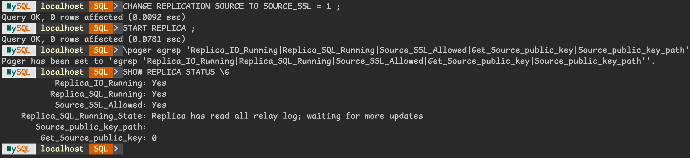
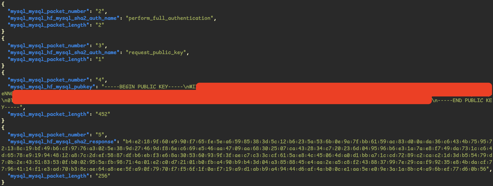
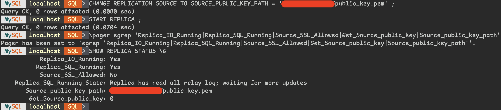


[日常維運鬼故事系列](tags/routines/)


## Introduction

在談 `caching_sha2_password` 之前先來聊聊為什麼有這議題，<br>
事情是發生在同仁測試 `caching_sha2_password` 時發生的鬼故事 :ghost:

```bash
之前說 CHANGE REPLICATION SOURCE 的語法要新增
GET_SOURCE_PUBLIC_KEY = 1
測試後加不加都可以哦

拿掉後...

奇怪，怎麼出現同步錯誤了
會出現以下錯誤
Authentication plugin 'caching_sha2_password' reported error:
Authentication require secure connection.

咦，現在突然又好了，
有在反覆測試都正常，
我剛剛沒有動什麼，
看來沒事，只是場誤會
結論是加不加都可以哦
```

來吧，讓我們來解開這場誤會吧 :hugging_face:

## Term
>
> 在開始之前，我們先來上一堂簡易的密碼學吧 !

* Plaintext ( 明文 ) : 看得懂的文字，比如 Hello World
* Ciphertext ( 密文 ) : 明文 經過 加密 動作後，產生看不懂的文字，比如 Xyskh Twasg
* Encrypt ( 加密 ) : 將 明文 轉換成 密文 的動作，大多使用金鑰 ( 公鑰 ) 來實現
* Decrypt ( 解密 ) : 將 密文 轉換回 明文 的動作，大多使用金鑰 ( 私鑰 ) 來實現
* Key ( 金鑰 ) : 加密 / 解密 時使用的鑰匙

## 對稱式加密
>
> 簡單來說，就是 Encrypt / Decrypt 使用同一把 Key


可以想成 密碼鎖，<br>
只要我們使用同一組密碼 ( Key )，比如 0306 來當密碼，<br>
在傳送過程就可以安全的傳送資料，<br>
儘管傳送過程被攔截了，只要 Hacker 不知道密碼是 0306，<br>
他就沒辦法得到相關資訊

### Pros

快，速度很快，Encrypt / Decrypt 的過程相對容易，<br>
只需要知道 Key 就可以快速的 Encrypt / Decrypt

### Cons

困難點就是在於那句 `只需要知道 Key`，我們要怎麼安全的將 Key 通知給對方呢 ?

## 非對稱式加密
>
> 簡單來說，就是 Encrypt / Decrypt 使用不同把 Key ( Public / Private )


可以將 鎖頭 想像成 Public Key，而 鑰匙 就是 Private Key<br>
我可以將 鎖頭 隨意的發給每一個人，甚至是放在公開的地方，<br>
想傳訊息給我的人，只需要拿這 鎖頭 來 Encrypt，<br>
身為有 鑰匙 的我，就可以安全的 Decrypt 得到資訊，<br>
儘管 Hacker 攔截了，<br>
只要沒有這把 鑰匙，他就沒辦法得到相關資訊

### Pros

安全，Public Key 可以方便得讓大家取得

### Cons

慢，速度很慢，Encrypt / Decrypt 的過程是仰賴複雜的數學運算達成的

## 混合式加密
>
> 顧名思義，就是把 對稱式加密 / 非對稱式加密 混合在一起，截長補短


先使用 非對稱式加密 把 密碼鎖 跟 密碼 ( Session Key ) 加密，<br>
後續再使用 對稱式加密 拿 密碼鎖 來傳送資訊<br>
既可以避免掉 對稱式加密 的缺點，使用 非對稱式加密 來安全的傳送 Key；<br>
也可以避免掉 非對稱式加密 的缺點，使用 對稱式加密 來快速的傳送資訊

## Caching_sha2_password
>
> 好了，可以回歸正題來談 MySQL 囉

本質上是一個數學的演算法 ( SHA256 )，用來 Encrypt MySQL 的 Password，<br>
MySQL 要求傳送 Password 時，必須在安全的連線環境 ( TLS ) 或使用 非對稱式加密 ( RSA )<br>
所以 MySQL 改用 `caching_sha2_password` 後，要登入的話需要滿足以下其中一項條件

### 使用 TLS 的連線

MySQL 語法

```MySQL
CHANGE REPLICATION SOURCE TO
  SOURCE_HOST = 'host_name' ,
  SOURCE_PORT = port_num ,
  SOURCE_USER = 'user_name' ,
  SOURCE_PASSWORD = 'password' ,
  SOURCE_AUTO_POSITION = 1 ,
  SOURCE_SSL = 1 ;
```



使用 `tshark` 錄製封包解析


### 使用 RSA
>
> 用 Public Key Encrypt 交換 Ciphertext，<br>
> 給 Server 驗證 Password，<br>
> 驗證成功後 Cache 在 Server

又分成兩種方式，<br>
一種是 `GET_SOURCE_PUBLIC_KEY`，<br>
在第一次連線時，Client 主動跟 Server 藉由 TCP 來取得 Public Key<br>
另外一種是 `SOURCE_PUBLIC_KEY_PATH`，<br>
Client 已經有 Server Public Key 時，指定 Key 所在位置

#### 配置 GET_SOURCE_PUBLIC_KEY

MySQL 語法

```MySQL
CHANGE REPLICATION SOURCE TO
  SOURCE_HOST = 'host_name' ,
  SOURCE_PORT = port_num ,
  SOURCE_USER = 'user_name' ,
  SOURCE_PASSWORD = 'password' ,
  SOURCE_AUTO_POSITION = 1 ,
  GET_SOURCE_PUBLIC_KEY = 1 ;
```


使用 `tshark` 錄製封包解析



#### 配置 SOURCE_PUBLIC_KEY_PATH

MySQL 語法

```MySQL
CHANGE REPLICATION SOURCE TO
  SOURCE_HOST = 'host_name' ,
  SOURCE_PORT = port_num ,
  SOURCE_USER = 'user_name' ,
  SOURCE_PASSWORD = 'password' ,
  SOURCE_AUTO_POSITION = 1 ,
  SOURCE_PUBLIC_KEY_PATH = '/xxx/xxx/xxx/xxxx/public_key.pem';
```



使用 `tshark` 錄製封包解析


這邊測試了兩次，分別是 非第一次連線 以及 第一次連線，<br>
當 非第一次連線 時，因為 Server 已經 Cache 相關的驗證機制，<br>
可以從封包看到 MySQL 會使用 `fast_auth_success`<br>
當 第一次連線 時，是使用 `perform_null_authentication`，<br>
會進行完整的驗證

## Summary

好了，現在我們可以回頭來回答一開始同仁的誤會<br>
當我們沒有加 `GET_SOURCE_PUBLIC_KEY`，<br>
又沒有使用 TLS 連線時，<br>
這時就會出現同步錯誤，<br>
因為我們帳號已經使用 `caching_sha2_password` 的認證方式了<br>
至於為什麼後續會出現「咦，又好了」的原因，<br>
就只是同仁以為可能跟帳號密碼有關，<br>
於是就自己手動使用該帳號登入過一次 Server，<br>
( `mysqlsh -u user_name -p -h server_ip --ssl-mode=PREFERRED` )<br>
`--ssl-mode=PREFERRED` 是預設的設定，<br>
然後就被 Server Cache 住，<br>
所以後續同步又恢復正常囉<br>

那句我沒有動什麼常常就是導致問題的關鍵，<br>
如果每一個環節都跟你想像的一樣，<br>
那問題一開始就不會存在了 :joy:<br>
軟體界大多沒有鬼故事，<br>
所有的鬼故事都只是在於當下的技術能力不夠，<br>
無法通靈罷了

後續我嘗試去 Server 將同步用的帳號 KILL 掉，<br>
然後執行 `FLUSH PRIVILEGES;` 去觸發 Cache 的清除，<br>
同步就會又出現錯誤囉 :smiling_imp:<br>

看完這篇文章的你，這次知道怎麼了嗎 ? :angel:

## Afterword

算是把最後一塊拼圖拼上去的感覺，<br>
感覺特別舒暢<br>

當工作維運很長一段時間之後，<br>
會覺得一切日常都很僵化，<br>
不再出現火花。<br>
每天渾渾噩噩、忙茫盲，<br>
日復一日、年復一年，<br>
這時如果遇到一些無法解釋的事情，<br>
會覺得特別有趣 :fire:<br>
把觀念釐清、再加上驗證，<br>
概念完全清晰之後，就會感覺自己又多成長了一些 :partying_face:

密碼學的部分是在大學時期上過的，<br>
基本上都還得差不多了 :joy:<br>
這邊只是簡單帶到部分概念而已，<br>
還有很多問題可以延伸，<br>
比如說，我要怎麼確保 Public Key 真的是你的 ? <br>
Digital Signature ( 數位簽章 ) 又是什麼 ? <br>
可以怎麼預防 MITM ( 中間人攻擊 ) ? <br>
解決方案之一的 Certificate Authority ( CA ) 可以吃嗎 ? <br>
這邊就先不展開了，<br>
有興趣歡迎一起學習聊聊 :smile:

---

## Reference

* [MySQL 8.4 Documentation : 8.3 Using Encrypted Connections](https://dev.mysql.com/doc/refman/8.4/en/encrypted-connections.html)
* [MySQL 8.4 Documentation : 8.4.1.2 Caching SHA-2 Pluggable Authentication](https://dev.mysql.com/doc/refman/8.4/en/caching-sha2-pluggable-authentication.html)
* [MySQL 8.4 Documentation : 15.4.2.2 CHANGE REPLICATION SOURCE TO Statement](https://dev.mysql.com/doc/refman/8.4/en/change-replication-source-to.html)
* [tshark Manual Page](https://www.wireshark.org/docs/man-pages/tshark.html)
