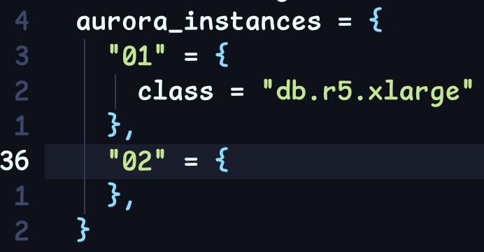


2025-12-14 updates ! 新增 AWS TAM 回覆



這跟之前撰寫過的這篇類似<br>
[[AWS] Restoring a backup into an Amazon RDS for MySQL DB instance and Configuring external source replication](/blog/restoring-a-backup-into-an-amazon-rds-for-mysql-db-instance-and-configuring-external-source-replication/
)<br>
只是主角從 RDS for MySQL 變成了 Aurora MySQL


[aws_mysql_replication]: /blog/restoring-a-backup-into-an-amazon-rds-for-mysql-db-instance-and-configuring-external-source-replication/

## Introduction

需求是希望 GCP 在 GCE 上自建的 MySQL 跟 AWS Aurora 互為備援，<br>
達到 DR 效果。<br>
具體架構圖可參考

適用場景在於當 DR 發生時，會將 Source 從 GCP 切過去 AWS Aurora，<br>
等到 GCP outage 解決後，會再安排時間把 Source 切回來 GCP。<br>
為了達到這需求，<br>
原來的 GCP 需要有一台 ( Standby ) 定期跟 AWS Aurora 同步資料 - `POC2` <br>
整條鏈路預計做法

### AWS Aurora DR Step

* GCP 的 MySQL 服務使用 Percona XtraBackup ( PXB ) 備份
* 傳送備份檔至 AWS S3
* 還原至 AWS Aurora
* 建置 Site-to-Site VPN 打通 AWS <-> GCP
* 建置 MySQL Replication ( AWS -> GCP ) - `POC1`
* 建置 Aurora Reader
* 建置 MySQL -> Aurora Reader ( GCP -> AWS ) - `POC2`

## 建置 AWS RDS DR

### POC1 - 建置 MySQL Replication ( AWS -> GCP )

請參照 [[AWS] Restoring a backup into an Amazon RDS for MySQL DB instance and Configuring external source replication][aws_mysql_replication] 建置即可，<br>
需要特別留意以下部分<br>

* `s3_source_engine` : 這邊要輸入 `mysql`
* `s3_source_engine_version` : 這邊要輸入 MySQL 的版本，以這次為例，要輸入 `8.0`

> Ref : [restore-db-cluster-from-s3 - AWS CLI](https://awscli.amazonaws.com/v2/documentation/api/2.0.34/reference/rds/restore-db-cluster-from-s3.html)

跟同步的語法使用 [rds_set_external_source_with_auto_position](https://docs.aws.amazon.com/AmazonRDS/latest/AuroraUserGuide/mysql-stored-proc-replicating.html#mysql_rds_set_external_source_with_auto_position)

```MySQL
### 連到 RDS，執行以下 Stored Procedures
CALL mysql.rds_set_external_source_with_auto_position (
  host_name
  , host_port
  , replication_user_name
  , replication_user_password
  , ssl_encryption
);

### 本次範例使用的指令
CALL mysql.rds_set_external_source_with_auto_position (
  '10.8.8.8'
  , 3306
  , 'aws_rds_rep'
  , 'YangTest@123'
  , 0
);

### 開始同步
CALL mysql.rds_start_replication() ;

### 然後就成功了
SHOW REPLICA STATUS \G
             Replica_IO_Running: Yes
            Replica_SQL_Running: Yes
```

其餘 Aurora 就跟建置 RDS 方式大同小異

> 公司內部使用的 Terraform Aurora Modules 有支援 Restore From S3 的相關配置，
> 但是公司內部 Modules，無法分享請見諒，有問題可以詢問哦

### POC2 - 建置 MySQL -> Aurora Reader ( GCP -> AWS )

#### 再建置一台 Aurora Reader



這邊以 **02** 為例，<br>
在 Aurora Cluster 中，第一台建置的 Instance 就是 Writer，其餘都是 Reader，<br>
所以目前規劃上會希望使用無意義的流水號來代替機器名稱，<br>
而不是有意義的 Writer 或者是 Reader

#### 設定 `/etc/hosts` ( 過渡期使用，後續導入 Internal DNS 機制後可以忽略此步驟 )

先使用 AWS bastion 藉由 `nslookup` 取得 Aurora 的實際 IP，<br>
以下圖為例，IP 為 `10.2.1.33`


將 Aurora 相關資訊設定於 GCP GCE 的 `/etc/hosts`


#### Aurora 開啟 Binary Logs 保留 ( 從 Writer 設定 )


Ref : [Setting up binary log replication for Aurora MySQL - Amazon Aurora](https://docs.aws.amazon.com/AmazonRDS/latest/AuroraUserGuide/AuroraMySQL.Replication.MySQL.SettingUp.html)

#### 建立 GCP -> AWS 同步


#### 然後就失敗啦

```MySQL
 MySQL  localhost  SQL > SHOW REPLICA STATUS \G
*************************** 1. row ***************************
             Replica_IO_State:
                  Source_Host: xxxxxxx-xxxx-xxx-xxxxx-xxxxxx-xx.xxxxxxxxxxxx.xxxxxxxxx.rds.amazonaws.com
                  Source_User: *******
                  Source_Port: 3306
                Connect_Retry: 60
              Source_Log_File:
          Read_Source_Log_Pos: 4
               Relay_Log_File: dba-xxxxx-xxxxxx-xxxxxxx-xxxx-relay-bin.000001
                Relay_Log_Pos: 4
        Relay_Source_Log_File:
           Replica_IO_Running: No
          Replica_SQL_Running: Yes
              Replicate_Do_DB:
          Replicate_Ignore_DB:
           Replicate_Do_Table:
       Replicate_Ignore_Table:
      Replicate_Wild_Do_Table:
  Replicate_Wild_Ignore_Table:
                   Last_Errno: 0
                   Last_Error:
                 Skip_Counter: 0
          Exec_Source_Log_Pos: 0
              Relay_Log_Space: 157
              Until_Condition: None
               Until_Log_File:
                Until_Log_Pos: 0
           Source_SSL_Allowed: No
           Source_SSL_CA_File:
           Source_SSL_CA_Path:
              Source_SSL_Cert:
            Source_SSL_Cipher:
               Source_SSL_Key:
        Seconds_Behind_Source: 0
Source_SSL_Verify_Server_Cert: No
                Last_IO_Errno: 13114
                Last_IO_Error: Got fatal error 1236 from source when reading data from binary log: 'Binary log is not open'
               Last_SQL_Errno: 0
               Last_SQL_Error:
  Replicate_Ignore_Server_Ids:
             Source_Server_Id: 0
                  Source_UUID: 7868ba12-6342-3cbb-9b8f-ca35a09bf469
             Source_Info_File: mysql.slave_master_info
                    SQL_Delay: 0
          SQL_Remaining_Delay: NULL
    Replica_SQL_Running_State: Replica has read all relay log; waiting for more updates
           Source_Retry_Count: 86400
                  Source_Bind:
      Last_IO_Error_Timestamp: 251008 12:41:17
     Last_SQL_Error_Timestamp:
               Source_SSL_Crl:
           Source_SSL_Crlpath:
           Retrieved_Gtid_Set:
            Executed_Gtid_Set: 1b31a695-a3f4-11f0-a8a0-42010a246409:1-45
                Auto_Position: 1
         Replicate_Rewrite_DB:
                 Channel_Name:
           Source_TLS_Version:
       Source_public_key_path:
        Get_Source_public_key: 0
            Network_Namespace:
1 row in set (0.0006 sec)
```

錯誤訊息是找不到 Binary Logs，<br>
從 Reader 的 `SHOW VARIABLES` 查看確實沒有開啟，


查了幾篇文章跟官方文件，目前是懷疑 Replica 不支援開啟 binary logs，<br>
後續會再與 AWS TAM 確認

> Ref :
>
> * Note: Amazon Aurora MySQL does not support BinLog replication on read replicas.<br>
> [Amazon Aurora MySQL - Hevo Data](https://docs.hevodata.com/sources/dbfs/databases/mysql/amazon-aurora-mysql/)
> * You can only pull binary logs from the Writer Instance.<br>
> [Can we configure separate binary logging (binlog) on Aurora MySQL's Read REplica instance?](https://repost.aws/questions/QUQuQ2eje6TnatP_lAtdydhg/can-we-configure-separate-binary-logging-binlog-on-aurora-mysql-s-read-replica-instance)


2025-12-14 AWS TAM : <br>
因為 RDS 或 Aurora 的 Binary logs 只存在 Writer 上，<br>
所以 Reader 無法產生 Binary logs，<br>
之前回覆有誤，只有自建的 MySQL Cluster 才能使用 Slave AS a Binlog Source


### POC3 - 建置 MySQL -> Aurora Writer ( GCP -> AWS )


上面的步驟再來一次，只是這次改成 Writer

#### 設定 `/etc/hosts` ( 過渡期使用，後續導入 Internal DNS 機制後可以忽略此步驟 )

先使用 AWS bastion 藉由 `nslookup` 取得 Aurora 的實際 IP，<br>
以下圖為例，IP 為 `10.2.1.100`


將 Aurora 相關資訊設定於 GCP GCE 的 `/etc/hosts`


#### 建立 GCP -> AWS 同步


#### 這次就成功囉

```MySQL
### 開始同步
START REPLICA ;

### 然後就成功了
SHOW REPLICA STATUS \G
             Replica_IO_Running: Yes
            Replica_SQL_Running: Yes
```

## Summary

沒什麼特別的，基本上這跟 Aurora 沒有太多相關，<br>
除了 Binary Logs 的部分有點差異以外，<br>
其餘的只要運用 MySQL 的知識，不會遇到什麼太大的問題

## Afterword

### ERROR: 1267 (HY000): Illegal mix of collations (utf8mb4_general_ci,IMPLICIT) and (utf8mb4_0900_ai_ci,IMPLICIT) for operation 'regexp_like'

一開始有遇到語系的問題，<br>
在 GCP ( Source ) 使用我們 8.0 公版設定檔，<br>
當初為了兼容 5.7，所以有額外設定<br>
`collation_server = utf8mb4_general_ci`<br>
後續使用 PXB 還原至 Aurora 後，<br>
出現 PROCEDURE ( mysql.rds_set_external_source_with_auto_position ) 無法使用的問題<br>


查了一下，跟語系有關，<br>
當 Source 設定 `collation_server = utf8mb4_general_ci`，<br>
然後使用 PXB 還原至 Aurora 後，<br>
Auroa PROCEDURE 的設定

```MySQL
collation_connection: utf8mb4_0900_ai_ci
  Database Collation: utf8mb4_general_ci
```

預設 Aurora 沒修改語系建立後的 PROCEDURE 設定

```MySQL
collation_connection: utf8mb4_0900_ai_ci
  Database Collation: utf8mb4_0900_ai_ci
```

PROCEDURE 中有一段使用到 `REGEXP`

```MySQL
MySQL > SHOW CREATE PROCEDURE mysql.rds_set_external_source_with_auto_position \G
...
  SET @regex = '.*\"[[:space:]]*,[[:space:]]*[a-zA-Z_]+[[:space:]]*=[[:space:]]*\".*';
  IF host REGEXP @regex
  OR user REGEXP @regex
  OR passwd REGEXP @regex THEN
    SELECT "Invalid arguments" AS Message;
...
```

推測與這有關，<br>
因語系差異，造成上述錯誤，暫時沒想到解法，<br>
後續會再與 AWS TAM 確認

目前 workaround 是把 Source 的 `collation_server` 設定移除，<br>
維持預設的 `utf8mb4_0900_ai_ci`


2025-12-14 AWS TAM : <br>
提供三種解法<br>
a) 如果可以修改 MySQL 的 Collation，這是最直接的解法<br>

p.s. 不過後續我自行測試以及跟 Percona 原廠討論後，<br>
mysql 是 system 專用的 schema，<br>
是沒有辦法修改 Collation 的，<br>
只能初始化 Instance 後，再把資料匯入<br>

b) 如果影響很大，使用 Logical Backup 匯出，<br>
再使用 sed 的方式修改匯出檔案後再匯入<br>

Example : <br>
$ sed -i 's/utf8mb4_general_ci/utf8mb4_0900_ai_ci/g' dump.sql<br>
$ sed -i 's/COLLATE=utf8mb4_general_ci/COLLATE=utf8mb4_0900_ai_ci/g' dump.sql<br>

c) AWS TAM 其實最推薦使用 AWS DMS <br>
Example : <br>
$ aws dms create-replication-instance \ <br>
-replication-instance-identifier gcp-to-aurora \ <br>
-replication-instance-class dms.t3.medium \ <br>
-allocated-storage 50



---

## Reference

* [Aurora User Guide](https://docs.aws.amazon.com/AmazonRDS/latest/AuroraUserGuide/CHAP_AuroraOverview.html)
