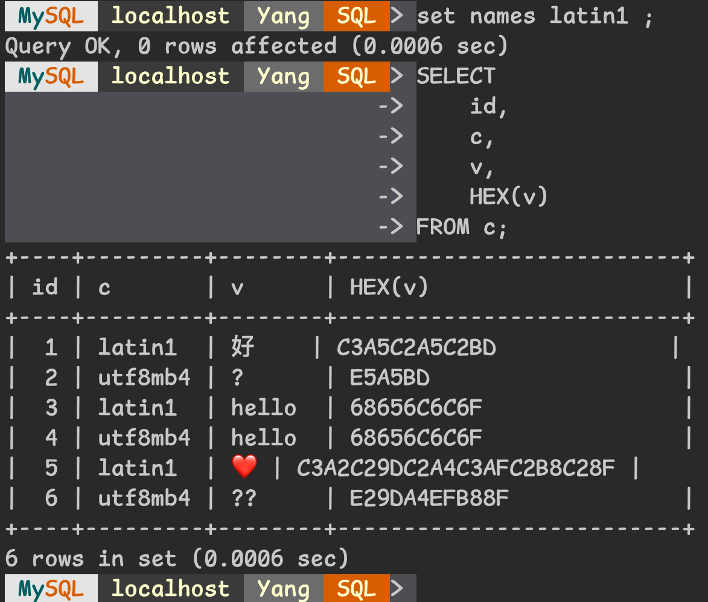
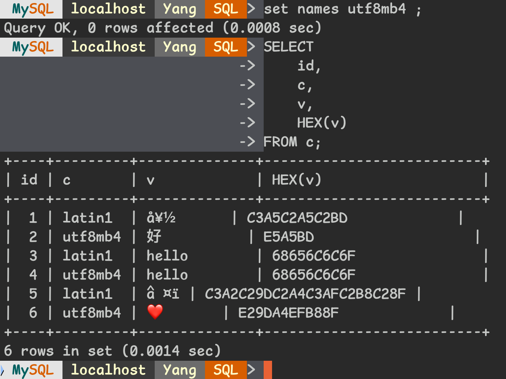
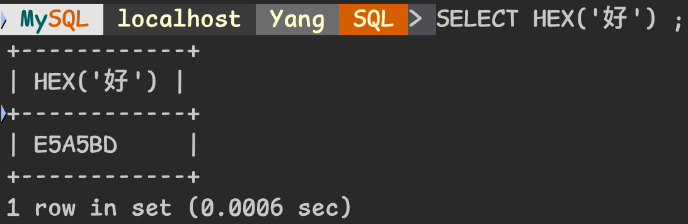
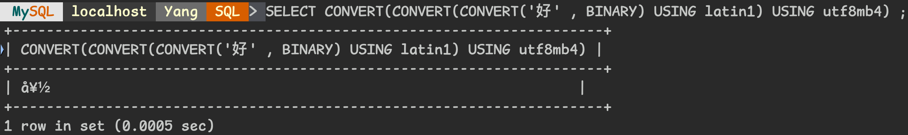
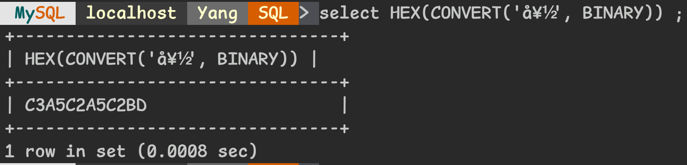
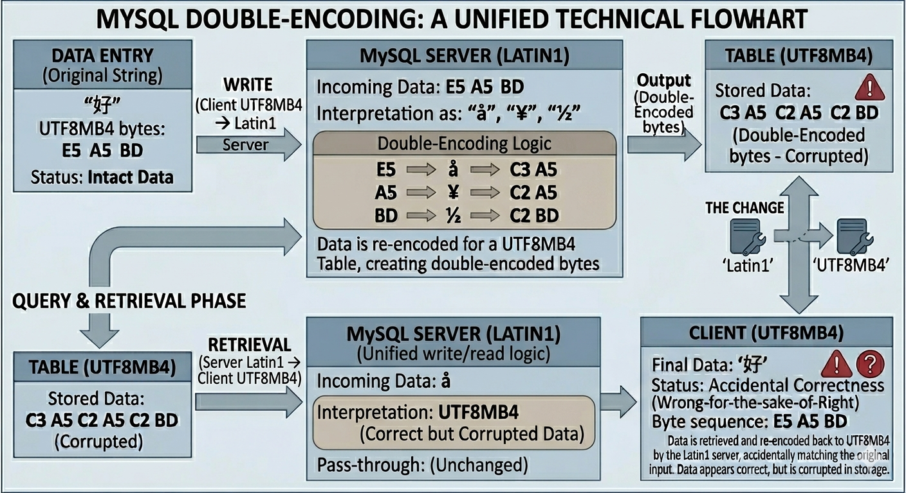
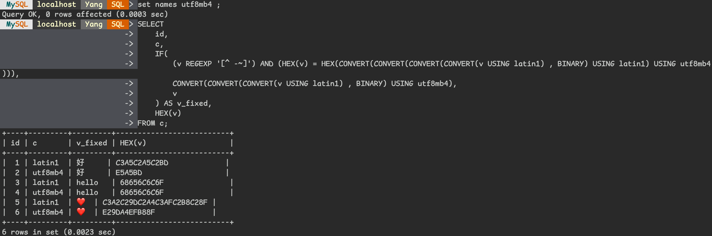
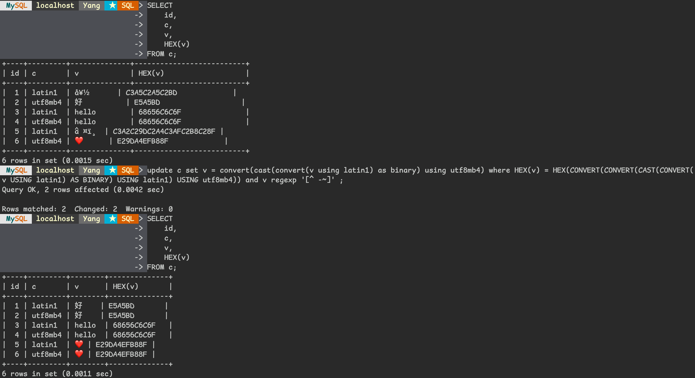
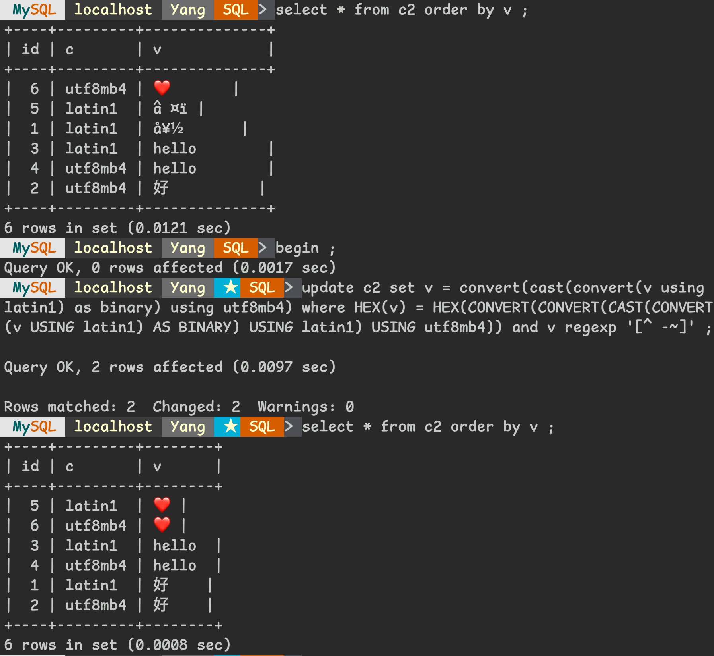


[日常維運鬼故事系列](tags/routines/)


## Introduction
>
> 這是一個古老的鬼故事 :ghost: ......

故事發生在我剛到某家公司工作時，那時資料庫的版本還在 MySQL 5.0，<br>
而 MySQL Default Character Sets 從 `latin1` 改為 `utf8mb4` 是發生在 MySQL 8.0 的事情 - Reference : [New Defaults in MySQL 8.0](https://dev.mysql.com/blog-archive/new-defaults-in-mysql-8-0/)<br>
所以理所當然的，MySQL Server 使用 `latin1` 也是一件很合理的事情，<br>
但隨著非英文語系儲存的需求漸增，加上 `utf8` 的日漸普及，<br>
當時啟動了一個專案名為 **「語系轉換計畫」**，<br>
目的是要將既有的 MySQL Server 從 `latin1` 轉換成 `utf8`。<br>

那時遇到一個蠻大的挑戰，<br>
某機群，MySQL Server 使用 `latin1` 編碼在運作著，<br>
但裡面有儲存了**中文字**，而且資料量體是在億級別。<br>
由於當時專業知識不足 + 剛到公司對於一切都還在熟悉 + 時程壓力，<br>
在專案期間並沒有正面解決該問題，<br>
而是選擇讓該機群的編碼持續使用 `latin1` 在運作，<br>
維持著「特例」的方式運作著，於是就此種下了一顆不安的種子。<br>
公司的 DBA 前輩當時還安慰我說了一句話，<br>
「沒事啦，反正以後的 DBA 遇到時就會有辦法解決了，就先這樣吧。」

沒想到，10 多年後的今天 ......<br>
種子發芽了，<br>
而我，就是那個 **以後的 DBA** :joy:

## Encoding Problem Overview

10 多年後的今天，剛好有點時間可以深入了解當初編碼到底是出現什麼問題，<br>
讓我先來貼幾張圖吧，我想一圖可以勝過萬語<br>

### MySQL Server latin1



當 MySQL Server 編碼設定為 `latin1` 時，<br>
`id : [ 1 , 3 , 4 , 5 ]` 可以正常呈現，其餘呈現 `?`；<br>

### MySQL Server utf8mb4



當 MySQL Server 編碼設定為 `utf8mb4` 時，<br>
`id : [ 2 , 3 , 4 , 6 ]` 可以正常呈現，其餘呈現 `亂碼`。<br>

綜合上方兩張圖可以發現，`HEX(v)` 的數值是一樣的，<br>
這是欄位 `v` 的十六進制表示，<br>
**文字會騙人，但 HEX 值不會**<br>
但還是很奇怪，為什麼同樣都是「好」，HEX 值會長不一樣呢 ?

接下來我們來聊聊為什麼會發生這現象吧 !

### Double Encoding

首先，我們先用一個文字來舉例說明，<br>
就用「好」這個字好了。<br>
「好」，使用 UTF8 編碼表示為 `E5 A5 BD`，由 3 個 Bytes 組成<br>

當資料從 Client 端送到 MySQL Server 後，<br>
Client 雖然是傳送 `utf8mb4` 編碼的 `E5 A5 BD` 給 MySQL Server，<br>
但因為 MySQL Server 編碼為 `latin1`，<br>
於是 MySQL Server 就將 `E5 A5 BD` 進行 `latin1` 的編碼，<br>
`E5` 對應到 `latin1` 為 `å`，<br>
`A5` 對應到 `latin1` 為 `¥`，<br>
`BD` 對應到 `latin1` 為 `½`。<br>

又因為 Table 的欄位定義為 `utf8mb4`，<br>
於是 MySQL 再將 `好` 進行 `utf8mb4` 編碼後存到 Table 中，<br>
最後結果就是存了 `C3A5C2A5C2BD` 到 Table 中囉 ! <br>

這就是 `Double Encoding` 的問題原因，<br>
要達成這問題的條件為<br>

1. MySQL Server 編碼設定為 `latin1`
2. Table 欄位定義為 `utf8mb4`

或者是相反也可以，<br>

1. MySQL Server 編碼設定為 `utf8mb4`
2. Table 欄位定義為 `latin1`

只要 MySQL Server 編碼跟 Table 的編碼是不同的，<br>
就會發生 `Double Encoding` 的問題 ! <br>


p.s. 準確一些來說，儘管 MySQL Server 編碼設定為 `latin1`，<br>
但如果 Client 連到 MySQL 後有再執行 `SET NAMES utf8mb4` 的話，<br>
就不會有 `Double Encoding` 問題哦


順帶一提，為什麼儲存經過了 `Double Encoding`，<br>
讀取資料時卻沒有問題呢 ? <br>
原因是因為讀取資料時也經過了 `Double Encoding` ! <br>
當資料從 Table 中讀取，<br>
因為欄位定義為 `utf8mb4`，會將 `C3A5C2A5C2BD` 進行 `utf8mb4` 解碼 -> `好`，<br>
又因為 MySQL Server 編碼設定為 `latin1`，<br>
於是再將 `好` 進行 `latin1` 解碼，轉回 `E5 A5 BD`，<br>
Client 端看到 `E5 A5 BD` 後用 `utf8mb4` 解碼後就看到了「好」這個字囉。<br>

問題點就只是一個積非成是的技術債罷了，當一個錯誤加上一個錯誤，剛好就變回正確



## Proposed Migration Plan

好了，現在我們知道問題點是什麼了，<br>
接下來就來思考要怎麼修復它吧 ! <br>
我個人做事習慣先掐頭，<br>
掐頭的意思是先讓 `Double Encoded` 的資料不再發生，<br>
也就是 MySQL Server 編碼改為 `utf8mb4`，<br>
我們再慢慢的用背景 UPDATE + LIMIT 的方式來修正舊資料，<br>
聽起來很美好對吧 ? <br>
這時，我們會先遇到第一道難關

### Garbled Output from Double Encoded latin1

當我們將 MySQL Server 編碼改為 `utf8mb4` 後，<br>
舊資料還尚未 UPDATE 成正確編碼時，SELECT 會出現`亂碼`的情況


解法很容易，我們可以在 SELECT 語法加上一些小魔法 :magic_wand:



```MySQL
SELECT
    id,
    c,
    IF(
        (v REGEXP '[^ -~]') AND (HEX(v) = HEX(CONVERT(CONVERT(CONVERT(CONVERT(v USING latin1) , BINARY) USING latin1) USING utf8mb4))),
        CONVERT(CONVERT(CONVERT(v USING latin1) , BINARY) USING utf8mb4),
        v
    ) AS v_fixed,
    HEX(v)
FROM c;
```

小魔法就是使用 `IF` 來判斷，<br>
當欄位是 `Double Encoded` 時，使用 `HEX + CONVERT` 的方式來重新編碼呈現；<br>
當欄位是正確編碼時，就單純原始欄位呈現。<br>
**語法修改需要使用單位協助配合調整，直到資料全部修正完畢為止**

<!-- markdownlint-disable -->

額外補充一下 `REGEXP '[^ -~]'` 用法，<br>
`^` 代表反向匹配，<br>
` -~` 代表「空格」到「波浪號」，也就是 ASCII 32(空格) 到 126(波浪號)，<br>
合起來就是「當欄位不是 ASCII 32 ~ 126 之間的文字時，回傳 `TRUE`」，<br>
這可以幫我們過濾「大小寫英文」以及「數字」等等不會受到編碼影響的資料

<!-- markdownlint-enable -->

### How to Fix Double Encoded latin1 Data

下一道難關，我們要怎麼修正舊資料呢 ? <br>
我們已經知道怎麼找出哪些欄位存在 `Double Encoded` 問題，<br>
也知道怎麼將資料修正成正確的編碼，<br>
那我們當然可以組出相對應的 UPDATE 語法囉



```MySQL
UPDATE c
    SET v = CONVERT(CONVERT(CONVERT(v USING latin1) , BINARY) USING utf8mb4)
WHERE
    HEX(v) = HEX(CONVERT(CONVERT(CONVERT(CONVERT(v USING latin1) , BINARY) USING latin1) USING utf8mb4)) AND
    v REGEXP '[^ -~]' ;
```

WHERE 條件就跟上述的小魔法提到的一樣，<br>
撈出存在編碼問題的資料後，將其修正為正確編碼的資料。<br>
這只是示意語法，實際執行時請搭配 `Script + LIMIT + Sleep` 的方式，<br>
以`不同步落後、不影響線上運作`的方式執行，<br>
因為這語法有幂等性，故可以無腦同一句語法反覆執行，<br>
直到沒有資料需要更新為止<br>

所以理想上做法是

1. 例行停機維護時，資料庫修改 `my.cnf`，移除語系相關設定(`--skip-character-set-client-handshake`)，編碼修改為 `utf8mb4`
2. 使用單位同時配合修改 SELECT 語法
3. DBA 持續對線上資料庫執行腳本，進行 `Script + LIMIT + Sleep` 更新資料
4. 以不同步落後、不影響線上運作的更新，直到資料全部修改完畢
5. 使用單位將 SELECT 語法改回 ( Optional )

好了，理想講完了，來聊聊現實的風險吧 :smiling_imp:

## Migration Risks

### Missing Updates in SELECT Queries

使用單位漏改了 SELECT 語法，<br>
基本上很難發現，因為功能大多時候會是正確的，只是顯示出現問題，<br>
當發生導致客訴時，唯一想到可以做的就是臨時性的調整 Script，<br>
先針對客訴的資料使用 Primary Key 進行修復來解決客訴

### JOIN and WHERE Conditions Using the Column

如果有使用到該欄位 JOIN 或者是 WHERE，在資料修正期間會有不穩定的情況發生，<br>
雖然也可以將小魔法加在條件中，但會讓資源消耗增加非常多，效能也會急遽的下降，<br>
因為使用 Function 後的欄位去 JOIN 或 WHERE，基本上 Index 就沒用處了，<br>
這問題暫時沒想到合適的解法<br>
~~或許 WHERE or JOIN 使用到中文本來就是一場悲劇~~

### Sorting Changes After Data Fix

這其實是一件非常正常的結果，<br>
之前如果使用到該欄位進行排序的話，根本就是祈禱流排序 :pray: <br>
毫無人類規則可言。<br>
改成 `utf8mb4` 後照理來說是變正常了，<br>
就只是怕大家壞久成自然，正常反而覺得異常 :clown:



### NO Reliable Rollback Strategy

這是此方案最大的問題，<br>
沒想到有效的 Rollback 方案 ! <br>
當第一句 UPDATE 修復資料啟動之後，基本上可以視為沒有 Rollback 方案，<br>
雖然還是有一些 Hack 的做法啦，<br>
比如 `--skip-character-set-client-handshake` 用 [init_connect](https://dev.mysql.com/doc/refman/8.4/en/server-system-variables.html#sysvar_init_connect) 來解，<br>
連線進來先 `SET NAMES latin1 ;` ；<br>
UPDATE 語法全部反向重做一次，語法就不組了，<br>
思路上就是撈取正確編碼，`HEX + CONVERT` 重新編碼回 `Double Encoded` 的資料。<br>
雖然看起來似乎還是可以 Rollback，但我就是覺得做法不太優雅，<br>
所以才說「沒想到有效的 Rollback 方案。」<br>

## Summary

雖然過了 10 多年後提出的解法並不是最佳解，<br>
不過這是在權衡了

1. 使用單位侵入性低 ( 期望上應該只需要修改 SELECT 語法 )
2. DBA 實作容易 ( `Script + LIMIT + Sleep` 無腦 UPDATE 即可 )
3. 可在 Staging 環境重現，模擬實際狀況
4. 漸進式調整 ( `Script + LIMIT + Sleep` )，不是一翻兩瞪眼的切換

上述幾個要素後提出的，<br>
當然，最大的風險還是在於沒有「有效的 Rollback 方案」，<br>
以及對於 QA 來說並不友善，要驗證內容有沒有出現亂碼，<br>
光想就覺得這是一件很人工活的事。<br>

不管怎樣，針對這種 Epic 層級的歷史技術債，<br>
要還清本來就不是一件容易的事，<br>
但考量到後續 `utf8mb4` 的普及以及支援，<br>
我想，這件事情該讓它到此為止，<br>
不要再讓 10 年後的 DBA 來解決它了 :joy:

## Afterword

這邊再額外提供幾個候選方案，<br>

* 使用 [pt-osc](https://docs.percona.com/percona-toolkit/pt-online-schema-change.html) 或者是 [gh-ost](https://github.com/github/gh-ost) 讓資料慢慢轉移到另外一張表，直到例行停機維護時，進行 Table Rename 的切轉

Cons:

    * 一翻兩瞪眼，開出維護後如果想要 Rollback，資料要怎麼同步需要再思考
    * 運行期間，基本上 MySQL Server 會有兩倍的寫入量增加，資源消耗較高
    * 就算在 Staging 環境重現，意義也不大，還是一翻兩瞪眼

* 一樣使用 UPDATE 的方案，只是在其中一台 Replica 執行，並在這台 Replica 再長出一棵一樣的樹，維護時，進行整個 Cluster 的切轉

Cons:

    * 一樣問題，會有 Rollback 資料同步的議題
    * 雖然不會有兩倍的寫入量增加，但機器資源會需要 Double，是 Cost 的增加
    * 一樣問題，在 Staging 環境重現意義也不大


graph TD;
%% Source Node;
Source[Source Database];

%% Tier 1 Replicas
R1[Replica 1]
R2[Replica 2]
R3[Replica 3]

%% Tier 2 Replicas (connected to Replica 3)
R3_1[Sub-Replica 3.1]
R3_2[Sub-Replica 3.2]
R3_3[Sub-Replica 3.3]

%% Replication Connections
Source --> R1
Source --> R2
Source --> R3

R3 --> R3_1
R3 --> R3_2
R3 --> R3_3

%% Styling for visual clarity
style Source fill:#f96,stroke:#333,stroke-width:2px
style R3 fill:#bbf,stroke:#333,stroke-width:2px


除了上述幾個候選方案以外，<br>
我其實一直在思考一件事，<br>
到底有什麼樣的情境，會需要走到 Rollback 這條路 ? <br>
初步想起來，最糟的情況也就是會出現亂碼，<br>
對於主要功能影響應該也不算 P0 等級，<br>
UI 顯示問題，也只會持續到 UPDATE 執行的這段期間，<br>
運氣好一些的話，或許客人重整畫面後就顯示正常了呢 :smile:

我唯一想到最有可能的是，<br>
程式中存在著<br>
「因為我知道從 MySQL Server 拿到會亂碼，所以我在程式端做了一層編碼的轉換」<br>
的這種邏輯，<br>
如果是這樣，那確實會走到 Rollback 這條路，<br>
那我真的是只好認輸了 :sweat_smile:

---

## Reference

* [MySQL 8.0 Collations: Migrating from older collations](https://dev.mysql.com/blog-archive/mysql-8-0-collations-migrating-from-older-collations/)
* [MySQL 8.0 Collations: Migrating from older collations, Part 2](https://dev.mysql.com/blog-archive/mysql-8-0-collations-migrating-from-older-collations-part-2/)
* [MySQL 8.4 Document: 12.3.1 Collation Naming Conventions](https://dev.mysql.com/doc/refman/8.4/en/charset-collation-names.html)
* [MySQL 8.4 Document: 12.10.1 Unicode Character Sets](https://dev.mysql.com/doc/refman/8.4/en/charset-unicode-sets.html#charset-unicode-sets-general-versus-unicode)
* [StackOverflow: Convert output of MySQL query to utf8](https://stackoverflow.com/questions/16051369/convert-output-of-mysql-query-to-utf8)
* [StackOverflow: Convert latin1 characters on a UTF8 table into UTF8](https://stackoverflow.com/questions/9407834/convert-latin1-characters-on-a-utf8-table-into-utf8)
* [Percona Blog: Migrating to utf8mb4: Things to Consider](https://www.percona.com/blog/migrating-to-utf8mb4-things-to-consider/)
