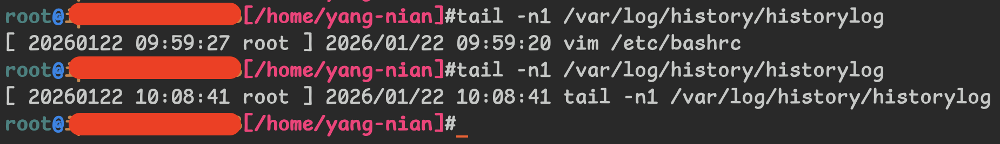
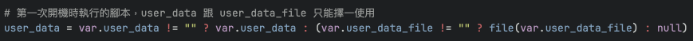


From GCP GCE startup scripts to AWS EC2 cloud-init 的過程


## Introduction

公司之前大多服務是部署於 GCP，<br>
但因為 DR 的議題，開始接觸了 AWS 環境，<br>
今天來聊聊有關 EC2 cloud-init 吧 ! <br>
了解我們怎麼將 GCE 的 [startup scripts](https://docs.cloud.google.com/compute/docs/instances/startup-scripts) 轉移至 EC2 的 [cloud-init](https://docs.aws.amazon.com/linux/al2023/ug/cloud-init.html)

## Background

最早期我們是從 OnPrem 起家的，<br>
所以當初上雲 ( GCP ) 時，也有討論過資料庫是否要選擇 CloudSQL 這種託管服務，<br>
但因為歷史種種因素不贅述，<br>
最終在 GCP 上我們是選擇建置 GCE，並安裝 MySQL 來提供服務。<br>

在 GCP 上，為了讓我們建置出來的 MySQL 服務能夠維持一致性，<br>
我們是藉由 GCE 的 [startup scripts](https://docs.cloud.google.com/compute/docs/instances/startup-scripts) 來實現的。<br>

到了 AWS，沒錯，這次選擇了託管服務 RDS :smile:<br>
也是種種因素就不贅述了，<br>
但就算是託管服務，我們還是會需要有一台 Bastion 機來執行一些 DBA 日常維運工作，<br>
如果只有一台兩台的，建置完畢後就幾乎不會再重建的話那也還好，<br>
就工人智慧一下，想裝什麼就裝什麼、想改什麼就改什麼，<br>
下次要重建時再想辦法回到過去就好了。<br>

BUT !<br>
我們公司目前在 AWS 上，還沒開始正式導入，<br>
就我經手到的，DBA 專用的 Bastion 機，就有 7 台了唷 :hugging_face: <br>
我覺得這已經不是工人智慧就可以解決的數量，<br>
於是開始尋找有沒有對比於 GCE startup scripts 的 EC2 方案。<br>

登愣，解決方案就是 [cloud-init](https://docs.aws.amazon.com/linux/al2023/ug/cloud-init.html) 囉 ! <br>

## cloud-init
>
> Cloud-init is an open source initialization tool that was designed to make it easier to get your systems up and running with a minimum of effort, already configured according to your needs.<br>
> -- *[cloud-init documentation](https://cloudinit.readthedocs.io/en/latest/explanation/introduction.html)*

我們在 AWS EC2 使用的 OS 為 AL2023，<br>
初始化也是使用 [cloud-init](https://docs.aws.amazon.com/linux/al2023/ug/cloud-init.html) 來實現的，<br>
我們也同樣使用它來為我們實現 EC2 的標準化建置。<br>

選定工具之後，接下來就是參考 GCE 的 [startup scripts](https://docs.cloud.google.com/compute/docs/instances/startup-scripts) 來轉移到 [cloud-init](https://docs.aws.amazon.com/linux/al2023/ug/cloud-init.html) 囉

### startup scripts

就如同上述所說的，我們會在 GCE 上安裝 MySQL 提供服務，<br>
所以並不是所有的 [startup scripts](https://docs.cloud.google.com/compute/docs/instances/startup-scripts) 都需要轉移到 [cloud-init](https://docs.aws.amazon.com/linux/al2023/ug/cloud-init.html)，<br>
很多有關 MySQL 的 scripts 在這次的轉移中就會捨棄，<br>
最後只留以下少數幾項我個人覺得適合 Bastion 機的 scripts

* timezone
* bashrc
* logrotate
* logrotate_history
* common_dnf_packages

#### timezone

因為 EC2 預設是使用 UTC，<br>
但我們日常維運，習慣使用當地時間，於是我們將 timezone 修改為 `Asia/Taipei`

```bash
TIME_ZONE="Asia/Taipei"
timedatectl set-timezone ${TIME_ZONE}
```

#### bashrc


雖然以下語法都是直接使用 `>>` Append 至檔案中，<br>
但實際使用時會有額外判斷，不會讓它重複執行，<br>
可以參閱 [cloud-init full](#cloud-init-full)


這是延續 OnPrem 就有的配置，<br>
我也覺得蠻實用的，就一直沿用著，<br>
`bashrc` 主要有幾項配置

* TMUX_TMPDIR <br>
因為日常維運中會使用 [tmux](https://github.com/tmux/tmux/wiki)，<br>
預設 [tmux](https://github.com/tmux/tmux/wiki) 會將 socket 儲存在 `/tmp` 底下，<br>
但 `/tmp` 目錄畢竟是暫存使用，<br>
曾經發生過 `cronjob` 觸發刪除 `/tmp` 底下檔案，<br>
導致 [tmux](https://github.com/tmux/tmux/wiki) 非預期的消失事件。<br>
故後續我們決議將 `TMUX_TMPDIR` 設定為非 `/tmp` 目錄，避免該情況發生

```bash
echo 'export TMUX_TMPDIR="${HOME}"' >> /etc/bashrc
```

* PS1 <br>

> PS1 詳細可以參考 [鳥哥 - 第十章、認識與學習BASH](https://linux.vbird.org/linux_basic/centos7/0320bash.php#variable_environ)

當然，我們會希望 Terminal 不要都是醜醜的黑底白字，<br>
總是需要有點顏色才比較有生氣嘛 :smile: <br>
還有加上一些功能的顯示

* \u : 顯示目前的使用者名稱
* \h : 顯示 hostname，直到第一個 . 為止
* \w : 當前目錄，就 `$PWD`，`$HOME` 會使用 `~` 代替
* \\$ : 如果 UID 為 0 ( 代表為 root )，會呈現 `#`，其餘是 `$`

```bash
cat <<EOF >> /etc/bashrc
export PS1="\[\e[1;36m\]\u\[\e[34m\]@\[\e[33m\]\h\[\e[35m\][\w]\[\e[0m\]\\\\$"
EOF
```

效果像這樣


#### logrotate_history

* HISTTIMEFORMAT <br>

用途就只是將 `history` 加上時間格式，詳細可以參考 [Linux manual](https://man7.org/linux/man-pages/man1/bash.1.html)

```bash
cat <<'EOF' >> /etc/bashrc
export HISTTIMEFORMAT=%Y"/"%m"/"%d" "%H":"%M":"%S" "
EOF
```

* PROMPT_COMMAND <br>

在 Bastion 機上，每次執行指令前，<br>
都會先執行 `PROMPT_COMMAND` 的指令，<br>
我們會用此來確認大家動作了什麼，來達到部分稽核的效果。<br>
用法是使用 `history 1` 取得最後一筆操作記錄，<br>
因為 `HISTTIMEFORMAT` 我們有加上時間了，<br>
`|` pipe 後只讀取 command 的部分，<br>
最後將結果輸出至 `/var/log/history/historylog`

```bash
cat <<'EOF' >> /etc/bashrc
export PROMPT_COMMAND='{ date "+[ %Y%m%d %H:%M:%S `whoami` ] `history 1 | { read x cmd; echo "$cmd"; }`"; } >> /var/log/history/historylog'
EOF
```

效果像這樣


#### logrotate

延續之前 OnPrem 的機制，<br>
我們會調整執行頻率，從 `weekly` 改成 `daily`，<br>
保留時間從 `rotate 4` 改成 `rotate 31`，<br>
將 `compress` 註解拿掉，讓它壓縮後保存。<br>

```bash
sed -i \
-e "s/^weekly/daily/g" \
-e "s/^rotate 4/rotate 31/g" \
-e "s/^#compress/compress/g" /etc/logrotate.conf
```

再加上剛剛新增的 [historylog](#logrotate_history) 相關的 logrotate 設定<br>

```bash
cat <<EOF > /etc/logrotate.d/history
/var/log/history/historylog
{
    daily
    rotate 180
    compress
    dateext
    create 0333 root root
}
EOF
```

#### common_dnf_packages

安裝一些 DBA 日常會使用到的套件，<br>
因為我們是 Percona 派的，<br>
所以會安裝 Percona 相關的 cli 日常維運使用。<br>

* `git` : 這不需要多提了吧，工程師必備 <br>
* `nc` : 主要用來測 port 以及網路傳輸檔案使用 <br>
* `tmux` : 多視窗工具，執行長時間任務時使用 <br>
* `percona-toolkit` : DBA 日常維運會使用到的工具，詳細可參考 [Percona Toolkit](https://docs.percona.com/percona-toolkit/) <br>
* `percona-client`、`percona-mysql-shell` : 連接 MySQL 服務的 Client 端 cli <br>

```bash
dnf install -y https://repo.percona.com/yum/percona-release-latest.noarch.rpm
percona-release setup ps-84-lts
percona-release enable pt
dnf -y install \
git \
nc \
tmux \
percona-toolkit \
percona-server-client \
https://downloads.percona.com/downloads/percona-distribution-mysql-ps/percona-distribution-mysql-ps-8.4.7/binary/redhat/9/x86_64/percona-mysql-shell-8.4.7-1.el9.x86_64.rpm
```

## Migration

除了上述的 [startup scripts](#startup-scripts) 以外，<br>
最後剩下 `ssh key` 需要轉移，<br>
在 GCP 時，我們是使用 [GCE Metadata](https://docs.cloud.google.com/compute/docs/instances/access-overview#ssh-access) 的方式來管理 `ssh key`，<br>
AWS 沒有類似的功能，<br>
我們需要直接登入 Bastion 機上使用 `useradd` 等 Linux 指令來管理帳號。<br>
這時，`cloud-init` 總算派上用場了，<br>
我們會使用 `cloud-init` 來建置帳號以及 `ssh key` 等的匯入，<br>
用法如下<br>

```yaml
#cloud-config
users:
  - name: yang-nian
    shell: /bin/bash
    sudo: ALL=(ALL) NOPASSWD:ALL
    lock_passwd: true
    ssh_authorized_keys:
      - ssh-rsa xxxxxxxxxxxxxxxxxxxxxxxxxxxxxxxxxxxxxxxxxxxxxxxxxxxxxxxxxxx
```

* name : 顧名思義，就是使用者名稱 <br>
* shell : 使用什麼 shell 登入
* sudo : sudo 相關設定，這邊是設定不限制也不需要密碼即可 sudo
* lock_passwd : 是否要鎖定密碼登入，`true` 代表鎖定，只能使用 `ssh key` 登入
* ssh_authorized_keys : 使用者的 `public key`

我們是使用 [Terragrunt](https://terragrunt.gruntwork.io) 來管理 AWS 資源，<br>
modules 是參考 [terraform-aws-modules/terraform-aws-ec2-instance](https://github.com/terraform-aws-modules/terraform-aws-ec2-instance) 改寫的，<br>
使用方法很容易，只需要將 `user_data` 代入即可，<br>
我們是使用 `file(var.user_data_file)` 的方式將 `cloud-init` 另外存成檔案，<br>
寫法如下<br>



加上後 `terragrunt apply` 即可，<br>
不過這邊有個小問題是 `cloud-init` 並不會重複執行，<br>
新建置的 EC2 會自動執行，這沒有問題。<br>
問題是發生在我們既有的 Bastion 機，<br>
我們 `terragrunt apply` 後需要自己進到 Bastion 機上重新觸發 `cloud-init`。<br>

觸發的方式是參考了 [stackoverflow 上的回覆](https://stackoverflow.com/questions/23065673/how-to-re-run-cloud-init-without-reboot) <br>

```bash
sudo cloud-init clean --logs
sudo cloud-init init
sudo cloud-init modules --mode=final
```

將 `cloud-init` 的相關 logs 清除，<br>
我們只需要重跑 init ( ssh key ) 以及 final stage ( user-data script ) 的部分即可，<br>
執行完可以驗證一下 `ls -lh /home` 是不是使用者有建立了，<br>
退出再重新進 Bastion 機來讀取 `/etc/bashrc`，<br>
確認 [startup scripts](#startup-scripts) 的部分都有成功執行。<br>


**Warning!** <br>
`cloud-init` 重跑後會重新產生機器的 `SSH host keys`，<br>
記得將 Client 端的 `known_hosts` 資訊清除，<br>
如果有任何依賴 SSH static host keys 的也需要記得修正


## Summary

新技能 Get ! <br>
一開始有打算還是乾脆把 GCE 的 [startup scripts](https://docs.cloud.google.com/compute/docs/instances/startup-scripts) 也換成 [cloud-init](https://docs.aws.amazon.com/linux/al2023/ug/cloud-init.html) ? <br>
這樣就可以達到 Cross Cloud 但支援同樣的腳本，<br>
後來仔細評估後，還是決定拆成兩份。<br>
主要原因是因為 GCE 是提供 MySQL 服務，<br>
EC2 只是單純的 Bastion 機使用，<br>
雖然有部分是共通的配置，但相較之下是少數，<br>
且 GCE 我們使用的 OS 是 [Rocky Linux 8](https://rockylinux.org)，<br>
這版本預設是沒有 [cloud-init](https://docs.aws.amazon.com/linux/al2023/ug/cloud-init.html) 的，<br>
基於以上原因，後續還是選擇拆開維護囉! <br>

還有一個原因是，我越看越覺得 [cloud-init](https://docs.aws.amazon.com/linux/al2023/ug/cloud-init.html) 並沒有我想像中的通用，<br>
我一開始以為 [cloud-init](https://docs.aws.amazon.com/linux/al2023/ug/cloud-init.html) 可以使用同一種表達語法，<br>
在不同 OS 系統自動偵測並轉換成對應的指令，<br>
舉例來說，我想要安裝 `httpd` 服務，<br>
我不需要去考慮 OS 系統，可以直接使用

```yaml
packages:
  - httpd
```

這種方式來安裝，<br>
但實際上是失敗的，<br>
因為在 Ubuntu 系統上，名稱其實要使用 `apache2` 而不是 `httpd`。<br>
它只能做到，<br>
假如是 Ubuntu 系統，<br>
使用 `apt-get install`；<br>
假如是 Rocky Linux 系統，<br>
使用 `dnf install`，<br>
僅此而已。<br>

不過對於 User 管理來說，[cloud-init](https://docs.aws.amazon.com/linux/al2023/ug/cloud-init.html) 確實可以帶來很大的幫助，<br>
所以最後決定將其混用，讓 [cloud-init](https://docs.aws.amazon.com/linux/al2023/ug/cloud-init.html) 單純負責 User 管理，<br>
startup scripts 的部分還是使用 scripts 來實現，<br>
並使用 `MIME` 格式將其合成同一個檔案，<br>
成果我就放在文章最下面囉，可以參考使用 [#cloud-init full](#cloud-init-full)

## Afterword

在轉移過程中還有發現一個小插曲，<br>
原先 GCE 我們在修改完 [timezone](#timezone) 後，<br>
會重啟 `rsyslog` 以及 `crond` 服務讓時區生效，<br>

```bash
systemctl restart rsyslog
systemctl restart crond
```

在 AL2023 時不需要這樣做<br>

### rsyslog

原因是因為 [systemd journal replaces rsyslog](https://docs.aws.amazon.com/linux/al2023/ug/journald.html) 囉 ! <br>
會自己配合機器的時區做轉換，<br>
大致上沒太大改變，<br>
就指令要改一下習慣

| rsyslog                          | journal                      |
| -------------------------------- | ---------------------------- |
| `cat /var/log/message`           | `journalctl`                 |
| `tail -f /var/log/message`       | `journalctl -f`              |
| `grep "hello" /var/log/messages` | `journalctl \| grep "hello"` |

### crond

也是因為 [systemd timers replace cron](https://docs.aws.amazon.com/linux/al2023/ug/cron.html) 囉 ! <br>
可以做到更精準的觸發時機，設定特殊時間、開機時以及開機後等等，<br>
詳細這邊就不展開囉，<br>
可以參考 [鳥哥 17.4 systemctl 針對 timer 的設定檔](https://linux.vbird.org/linux_basic/centos7/0560daemons.php#systemctl_timer)

## cloud-init full

```yaml
Content-Type: multipart/mixed; boundary="//"
MIME-Version: 1.0

--//
Content-Type: text/cloud-config; charset="us-ascii"
MIME-Version: 1.0
Content-Transfer-Encoding: 7bit
Content-Disposition: attachment; filename="cloud-config.yaml"

#cloud-config
users:
  - name: yang-nian
    shell: /bin/bash
    sudo: ALL=(ALL) NOPASSWD:ALL
    lock_passwd: true
    ssh_authorized_keys:
      - ssh-rsa xxxxxxxxxxxxxxxxxxxxxxxxxxxx
--//
Content-Type: text/x-shellscript; charset="us-ascii"
MIME-Version: 1.0
Content-Transfer-Encoding: 7bit
Content-Disposition: attachment; filename="setup-script.sh"

#!/bin/bash

## Common libs
log_message() {
  local level=$1
  shift
  local msg="$@"
  local timestamp=$(date +"%Y-%m-%d %H:%M:%S")

  case $level in
    info|warn|critical)
      echo " $timestamp level=$level msg=$msg "
      ;;
    *)
      echo " $timestamp level=critical Invalid log level '$level'. Message: $msg "
      ;;
  esac
}

log_warn() {
  local msg=$1
  log_message "warn" "${msg}"
}

log_critical() {
  local msg=$1
  log_message "critical" "${msg}"
}

log_info() {
  local msg=$1
  log_message "info" "${msg}"
}

log_wrong() {
  local msg=$1
  log_message "wrong" "${msg}"

}

execute_command() {
  local level=$1
  shift
  local command="$@"
  local output
  output=$(eval "$command" 2>&1)
  local exit_status=$?

  if [ $exit_status -eq 0 ]; then
    log_info "Command '$command' executed successfully. Output : $output"
  else
    case ${level} in
      info)
        log_info "Command '$command' failed with exit status $exit_status. Output : $output"
        ;;
      warn)
        log_warn "Command '$command' failed with exit status $exit_status. Output : $output"
        ;;
      critical)
        log_critical "Command '$command' failed with exit status $exit_status. Output : $output"
        ;;
      *)
        log_wrong "'$command' failed with wrong level. $exit_status. Output : $output"
        ;;
    esac
  fi
}

## Timezone

TIME_ZONE="Asia/Taipei"

execute_command critical "timedatectl set-timezone \"${TIME_ZONE}\""

## Bashrc

BASHRC_FILE="/etc/bashrc"
HISTORY_LOG_DIR="/var/log/history"

cat ${BASHRC_FILE} | grep "export TMUX_TMPDIR"
if [ $? -eq 1 ]; then
    execute_command critical "echo 'export TMUX_TMPDIR=\"\${HOME}\"' >> ${BASHRC_FILE}"
else
    log_info "tmux setting is exists."
fi

cat ${BASHRC_FILE} | grep "export PS1"
if [ $? -eq 1 ]; then
    execute_command critical "cat <<EOF >> ${BASHRC_FILE}
export PS1=\"\[\e[1;36m\]\u\[\e[34m\]@\[\e[33m\]\h\[\e[35m\][\w]\[\e[0m\]$\"
EOF"
else
    log_info "bash color is exists."
fi

cat ${BASHRC_FILE} | grep "export HISTTIMEFORMAT"
if [ $? -eq 1 ]; then
    execute_command critical "cat <<'EOF' >> ${BASHRC_FILE}
export HISTTIMEFORMAT=%Y\"/\"%m\"/\"%d\" \"%H\":\"%M\":\"%S\" \"
EOF"
else
    log_info "history format datetime is exists."
fi

if [ -d ${HISTORY_LOG_DIR} ]; then
    log_info "${HISTORY_LOG_DIR} is exists."
    log_info "[Skip] mkdir "${HISTORY_LOG_DIR}
else
    execute_command critical mkdir ${HISTORY_LOG_DIR}
fi

execute_command critical touch ${HISTORY_LOG_DIR}/historylog
execute_command critical chmod 333 ${HISTORY_LOG_DIR}/historylog

cat ${BASHRC_FILE} | grep "export PROMPT_COMMAND"
if [ $? -eq 1 ]; then
    cat <<'EOF' >> ${BASHRC_FILE}
export PROMPT_COMMAND='{ date "+[ %Y%m%d %H:%M:%S `whoami` ] `history 1 | { read x cmd; echo "$cmd"; }`"; } >> /var/log/history/historylog'
EOF
else
    log_info "PROMPT_COMMAND datetime is exists."
fi

## Logrotate

LOGROTATE_CONF="/etc/logrotate.conf"
LOGROTATE_HISTORY="/etc/logrotate.d/history"

execute_command critical "sed -i \
-e \"s/^weekly/daily/g\" \
-e \"s/^rotate 4/rotate 31/g\" \
-e \"s/^#compress/compress/g\" $LOGROTATE_CONF"

execute_command critical "cat <<EOF > ${LOGROTATE_HISTORY}
${HISTORY_LOG_DIR}/historylog
{
    daily
    rotate 180
    compress
    dateext
    create 0333 root root
}
EOF"

execute_command critical dnf install -y https://repo.percona.com/yum/percona-release-latest.noarch.rpm
execute_command info percona-release show
execute_command warn percona-release setup ps-84-lts
execute_command warn percona-release enable pt
execute_command info percona-release show

execute_command critical dnf -y install \
git \
nc \
tmux \
percona-toolkit \
percona-server-client \
https://downloads.percona.com/downloads/percona-distribution-mysql-ps/percona-distribution-mysql-ps-8.4.7/binary/redhat/9/x86_64/percona-mysql-shell-8.4.7-1.el9.x86_64.rpm

## Common Task

DBA_DIR="/usr/local/dba"

execute_command warn mkdir ${DBA_DIR}

--//--
```

---

## Reference

* [鳥哥的 Linux 私房菜](https://linux.vbird.org)
* [Amazone Linux : Customized cloud-init](https://docs.aws.amazon.com/linux/al2023/ug/cloud-init.html)
* [cloud-init documentation](https://cloudinit.readthedocs.io/en/latest/)
