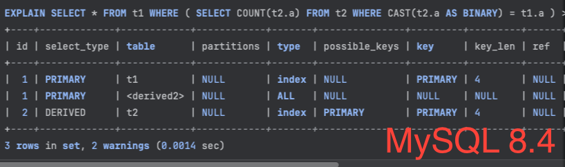
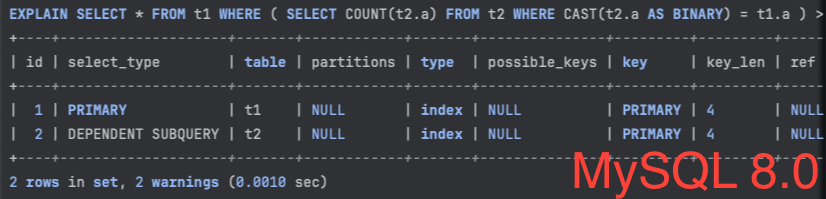


這是 [What Is New in MySQL 8.4 since MySQL 8.0](https://dev.mysql.com/doc/refman/8.4/en/mysql-nutshell.html) 的系列文，<br>
會針對部分我覺得跟日常維運有關的更動特別研究，<br>
其餘的就當故事書，看過知道即可


## Introduction

**Scalar correlated subqueries to derived tables.**<br>
MySQL 8.4.0 lifts a previous restriction on transforming a correlated scalar subquery to a derived table such that an operand of the equality expression which did not contain an outer reference could be a simple column reference only.

This means that inner columns can be contained in deterministic expressions, as shown here:

```MySQL
func1(.., funcN(.., inner-column-a, ..), inner-column-b) = outside-expression

inner-column-a + inner-column-b = outside-expression
```

For example, the following query is now supported for optimization:

```MySQL
SELECT * FROM t1
  WHERE ( SELECT func(t2.a) FROM t2
            WHERE func(t2.a) = t1.a ) > 0;
```

The inner operand cannot contain outer column references; likewise, the outer operand cannot contain inner column references. In addition, the inner operand cannot contain a subquery.

If the transformed subquery has explicit grouping, functional dependency analysis may be excessively pessimistic, resulting in an error such as `ERROR 1055 (42000): Expression #2 of SELECT list is not in GROUP BY clause and contains nonaggregated column ....`<br>
For the InnoDB storage engine, the transform is disabled by default (that is, the [subquery_to_derived][subquery_to_derived_link] flag of the [optimizer_switch][optimizer_switch_link] variable is not enabled); in this case, such queries pass without raising any errors, but are also not transformed.

See [Section 15.2.15.7, “Correlated Subqueries”](https://dev.mysql.com/doc/refman/8.4/en/correlated-subqueries.html), for more information.

> 以上引用至官方原文

[subquery_to_derived_link]: https://dev.mysql.com/doc/refman/8.4/en/switchable-optimizations.html#optflag_subquery-to-derived
[optimizer_switch_link]: https://dev.mysql.com/doc/refman/8.4/en/server-system-variables.html#sysvar_optimizer_switch

## Summary

先講結論，預設 [subquery_to_derived][subquery_to_derived_link] 這 [optimizer_switch][optimizer_switch_link] 是 `關閉` 的，<br>
我們也沒有特別調整過設定檔公版，所以影響沒有很大，<br>
知道有這功能，日後有需要時，再看看有沒有合適即可。<br>

預設是關閉的原因是，<br>
在大多情況下，開啟該參數並沒有顯著的效能改善 ( 甚至會有更慢的現象 )<br>
這句話是官方文檔寫的，不是造謠 :hugging_face:<br>
原文 : `The default value for this flag is off, since, in most cases, enabling this optimization does not produce any noticeable improvement in performance (and in many cases can even make queries run more slowly)`<br>

這功能最早是在 *8.0.21* 新增的，*8.4* 只是對該功能增加更多支援，<br>
當 `correlated subqueries` 是 deterministic funtions 時，<br>
就可以被 `subquery_to_derived` 進行改寫優化<br>

請參考以下差異

### MySQL 8.4

```MySQL
SHOW CREATE TABLE t1 \G
*************************** 1. row ***************************
       Table: t1
Create Table: CREATE TABLE `t1` (
  `a` int NOT NULL,
  PRIMARY KEY (`a`)
) ENGINE=InnoDB DEFAULT CHARSET=utf8mb4 COLLATE=utfTE TABLE t2 \G
*************************** 1. row ***************************
       Table: t2
Create Table: CREATE TABLE `t2` (
  `a` int NOT NULL,
  PRIMARY KEY (`a`)
) ENGINE=InnoDB DEFAULT CHARSET=utf8mb4 COLLATE=utf8mb4_0900_ai_ci

/* subquery_to_derived 預設為 OFF */
SELECT @@optimizer_switch like '%subquery_to_derived=OFF%' AS 'subquery_to_derived=OFF' ;
+-------------------------+
| subquery_to_derived=OFF |
+-------------------------+
|                       1 |
+-------------------------+
1 row in set (0.0008 sec)

EXPLAIN SELECT * FROM t1 WHERE ( SELECT COUNT(t2.a) FROM t2 WHERE CAST(t2.a AS BINARY) = t1.a ) > 0 ;
+----+--------------------+-------+------------+-------+---------------+---------+---------+------+------+----------+--------------------------+
| id | select_type        | table | partitions | type  | possible_keys | key     | key_len | ref  | rows | filtered | Extra                    |
+----+--------------------+-------+------------+-------+---------------+---------+---------+------+------+----------+--------------------------+
|  1 | PRIMARY            | t1    | NULL       | index | NULL          | PRIMARY | 4       | NULL |    1 |      100 | Using where; Using index |
|  2 | DEPENDENT SUBQUERY | t2    | NULL       | index | NULL          | PRIMARY | 4       | NULL |    1 |      100 | Using where; Using index |
+----+--------------------+-------+------------+-------+---------------+---------+---------+------+------+----------+--------------------------+
2 rows in set, 2 warnings (0.0008 sec)

SET SESSION optimizer_switch = 'subquery_to_derived=on' ;

/* subquery_to_derived 改成 ON */
SELECT @@optimizer_switch like '%subquery_to_derived=ON%' AS 'subquery_to_derived=ON' ;
+------------------------+
| subquery_to_derived=ON |
+------------------------+
|                      1 |
+------------------------+
1 row in set (0.0003 sec)

EXPLAIN SELECT * FROM t1 WHERE ( SELECT COUNT(t2.a) FROM t2 WHERE CAST(t2.a AS BINARY) = t1.a ) > 0 ;
+----+-------------+------------+------------+-------+---------------+---------+---------+------+------+----------+--------------------------------------------+
| id | select_type | table      | partitions | type  | possible_keys | key     | key_len | ref  | rows | filtered | Extra                                      |
+----+-------------+------------+------------+-------+---------------+---------+---------+------+------+----------+--------------------------------------------+
|  1 | PRIMARY     | t1         | NULL       | index | NULL          | PRIMARY | 4       | NULL |    1 |      100 | Using index                                |
|  1 | PRIMARY     | <derived2> | NULL       | ALL   | NULL          | NULL    | NULL    | NULL |    2 |      100 | Using where; Using join buffer (hash join) |
|  2 | DERIVED     | t2         | NULL       | index | PRIMARY       | PRIMARY | 4       | NULL |    1 |      100 | Using index; Using temporary               |
+----+-------------+------------+------------+-------+---------------+---------+---------+------+------+----------+--------------------------------------------+
3 rows in set, 2 warnings (0.0014 sec)
```

### MySQL 8.0

```MySQL
SHOW CREATE TABLE t1 \G
*************************** 1. row ***************************
       Table: t1
Create Table: CREATE TABLE `t1` (
  `a` int NOT NULL,
  PRIMARY KEY (`a`)
) ENGINE=InnoDB DEFAULT CHARSET=utf8mb4 COLLATE=utfTE TABLE t2 \G
*************************** 1. row ***************************
       Table: t2
Create Table: CREATE TABLE `t2` (
  `a` int NOT NULL,
  PRIMARY KEY (`a`)
) ENGINE=InnoDB DEFAULT CHARSET=utf8mb4 COLLATE=utf8mb4_0900_ai_ci

/* subquery_to_derived 預設為 OFF */
SELECT @@optimizer_switch like '%subquery_to_derived=OFF%' AS 'subquery_to_derived=OFF' ;
+-------------------------+
| subquery_to_derived=OFF |
+-------------------------+
|                       1 |
+-------------------------+
1 row in set (0.0007 sec)

EXPLAIN SELECT * FROM t1 WHERE ( SELECT COUNT(t2.a) FROM t2 WHERE CAST(t2.a AS BINARY) = t1.a ) > 0 ;
+----+--------------------+-------+------------+-------+---------------+---------+---------+------+------+----------+--------------------------+
| id | select_type        | table | partitions | type  | possible_keys | key     | key_len | ref  | rows | filtered | Extra                    |
+----+--------------------+-------+------------+-------+---------------+---------+---------+------+------+----------+--------------------------+
|  1 | PRIMARY            | t1    | NULL       | index | NULL          | PRIMARY | 4       | NULL |    1 |      100 | Using where; Using index |
|  2 | DEPENDENT SUBQUERY | t2    | NULL       | index | NULL          | PRIMARY | 4       | NULL |    1 |      100 | Using where; Using index |
+----+--------------------+-------+------------+-------+---------------+---------+---------+------+------+----------+--------------------------+
2 rows in set, 2 warnings (0.0016 sec)

SET SESSION optimizer_switch = 'subquery_to_derived=on' ;

/* subquery_to_derived 改成 ON */
SELECT @@optimizer_switch like '%subquery_to_derived=ON%' AS 'subquery_to_derived=ON' ;
+------------------------+
| subquery_to_derived=ON |
+------------------------+
|                      1 |
+------------------------+
1 row in set (0.0008 sec)

EXPLAIN SELECT * FROM t1 WHERE ( SELECT COUNT(t2.a) FROM t2 WHERE CAST(t2.a AS BINARY) = t1.a ) > 0 ;
+----+--------------------+-------+------------+-------+---------------+---------+---------+------+------+----------+--------------------------+
| id | select_type        | table | partitions | type  | possible_keys | key     | key_len | ref  | rows | filtered | Extra                    |
+----+--------------------+-------+------------+-------+---------------+---------+---------+------+------+----------+--------------------------+
|  1 | PRIMARY            | t1    | NULL       | index | NULL          | PRIMARY | 4       | NULL |    1 |      100 | Using where; Using index |
|  2 | DEPENDENT SUBQUERY | t2    | NULL       | index | NULL          | PRIMARY | 4       | NULL |    1 |      100 | Using where; Using index |
+----+--------------------+-------+------------+-------+---------------+---------+---------+------+------+----------+--------------------------+
2 rows in set, 2 warnings (0.0010 sec)
```

主要關注於最後 EXPLAIN 的結果<br>




在 *MySQL 8.4*，開啟 `subquery_to_derived=ON` 時，<br>
只要 `correlated subqueries` 的 functions 是 deterministic，<br>
就可以被改寫成 derived table 的語法進行查詢。<br>
在 *MySQL 8.0* 時，只有支援 simple column references<br>

| Type                       | Example                       |
|----------------------------|-------------------------------|
| Deterministic Functions    | `SUBSTR(),CONCAT(),CAST()...` |
| Nondeterministic Functions | `RAND(),NOW(),UUID()...`      |

## Afterword

這篇再研究後就默默地把它移除 :star: 的標記了 :joy:<br>
一開始是因為看到這跟 [optimizer_switch][optimizer_switch_link] 有關，<br>
所以才將其標記為 :star:，<br>
深入研究後發現這異動似乎沒什麼太大的影響，<br>
畢竟官方文檔都說了，預設為 `關閉` 的原因是因為對於大多數應用來說，<br>
這改變並沒有帶來顯著的改善。<br>

這時反而讓我好奇為什麼有這改動，事情的源頭是什麼 ? <br>
接著就去翻了 WorkLog，<br>
Open Source 的好處就是全部的異動紀錄都可以在 `Git` 上找到，<br>
而且這種有規模的 Open Source Project 都會有詳細的說明以及紀錄。<br>

*MySQL 8.0* 一開始新增的 commit 在 [WL#13520](https://github.com/mysql/mysql-server/commit/8fda114b31445ef4a604ff4941a2e2280a65434b)，<br>
重點在於其中寫到的這句 : <br>
`It is on by default for secondary engines like RAPID.`<br>
又帶來了另外的好奇，<br>
什麼是 `Secondary Engines` ?<br>
MySQL 不是就只剩下 `InnoDB Engines` 而已嗎 ? ( `NDB` 除外 )<br>

查了一下發現，<br>
原來這全是為了 Oracle MySQL Enterprise 在鋪路呀 :smiling_imp:<br>

不管是 `Secondary Engines` 還是 `RAPID`，<br>
這都跟 [MySQL HeatWave][mysql_heatwave_link] 有關，<br>
*MySQL 8.4* 這次的異動 commit 在 [WL#15540](https://github.com/mysql/mysql-server/commit/0354e465d918602b5ea9c51c8990947962978027)，<br>
其中的這句 : <br>
`This transformation is needed by Heatwave/RAPID, which doesn't support subqueries in the WHERE clause.` <br>
也可以發現，<br>
這異動都是為了 [MySQL HeatWave][mysql_heatwave_link] 做的改善，<br>
這下疑惑都解開了，<br>
目前公司主要是使用 [Percona MySQL](https://www.percona.com/mysql/software/percona-server-for-mysql)，<br>
短時間內應該是沒辦法摸到 [MySQL HeatWave][mysql_heatwave_link] 來玩玩了，<br>
只能等到日後有朝一日，再來看看這改動對於 [MySQL HeatWave][mysql_heatwave_link] 有什麼改善吧

[mysql_heatwave_link]: https://dev.mysql.com/doc/heatwave/en

---

## Reference

* [GitHub : mysql-server Commit 8fda114](https://github.com/mysql/mysql-server/commit/8fda114b31445ef4a604ff4941a2e2280a65434b)
* [GitHub : mysql-server Commit 0354e46](https://github.com/mysql/mysql-server/commit/0354e465d918602b5ea9c51c8990947962978027)
* [MySQL Documentation : 15.2.15.7 Corrlated Subqueries](https://dev.mysql.com/doc/refman/8.4/en/correlated-subqueries.html)
* [MySQL HeatWave Documentation : 4.2.6.2 Define the Secondary Engine](https://dev.mysql.com/doc/heatwave/en/mys-hw-defining-secondary-engine.html)
