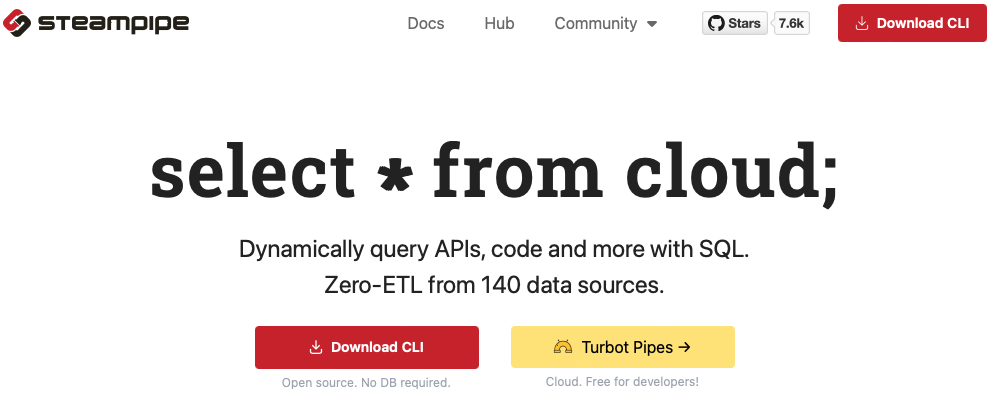
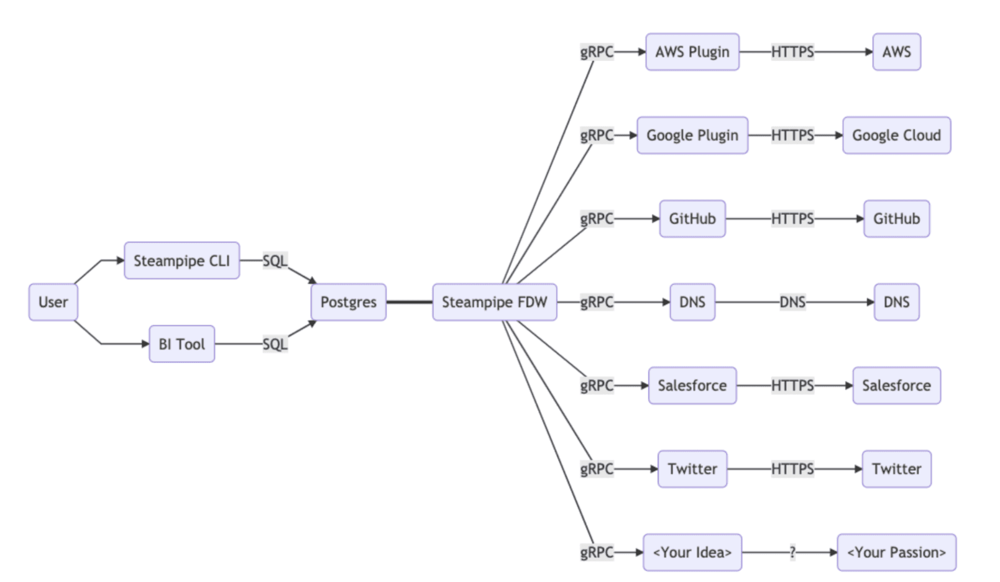
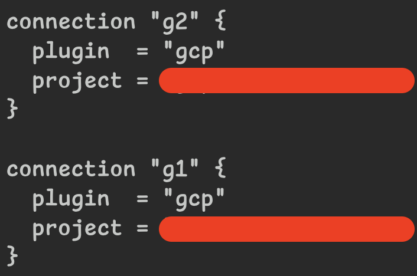
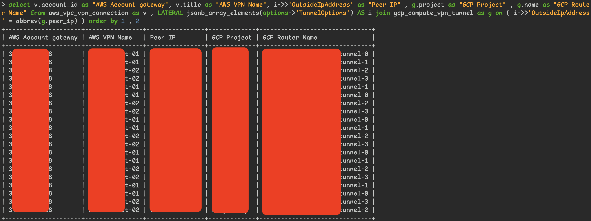


[CLI 小工具系列](tags/tooling/)


## Introduction

因應工作需求，使用到 GCP 以及 AWS 服務，<br>
又因為 DR 的關係，GCP 跟 AWS 之間有建置 [Site-to-Site VPN](https://docs.aws.amazon.com/vpn/latest/s2svpn/VPC_VPN.html)。<br>
GCP 的網路環境是使用 [Shared VPC ( XPN )](https://docs.cloud.google.com/vpc/docs/shared-vpc)，然後在 2 個不同的 Project；<br>
AWS 的網路環境是使用 [Resource Access Manager ( RAM )](https://aws.amazon.com/tw/ram/) 分享，獨立在 1 個 Account<br>

最近開始安排了建置 DR 相關的 RDS 任務，<br>
所以事前要檢查一下網路相關的配置時，<br>
發現 **超級麻煩**

我需要先確認 GCP 的 GCE Project 使用了哪些 XPN，<br>
再到這些 GCE 所使用的 XPN 檢查 Cloud VPN tunnels 的配置，<br>
確認跟 AWS site 的串接是否正確，<br>
還要確認是否有正確宣告 BGP 給 AWS，<br>
最後檢查<br>
GCP 的 FW 設定，<br>
有沒有開放 AWS 的網段，<br>
AWS 的 SG 設定，<br>
有沒有開放 GCP 的網段

感覺也還好呀，<br>
如果只需要確認一次的話我也覺得還好呀 !<br>
但我們有 24 個 GCP Project，<br>
每個 VPN 有 2 條 VPN tunnel，<br>
VPN 是 HA VPN，所以再 * 2<br>

又因為公司 MacBook 是 19 年的古董機，<br>
每次看到 GCP 的頁面一直轉圈圈，<br>
多開了三四五六個視窗，Safari 一言不合就閃退，<br>
雖然使用 `gcloud` 跟 `aws` 也很方便，但部分指令不太熟又需要一直爬 Doc<br>

這時，剛好看到一個 Tooling，<br>
主打使用 SQL 動態查詢 Cloud 的資源，<br>
身為一個 DBA，看到 SQL 語法倍感親切，<br>
今天，我們就來介紹這 Tooling - [Steampipe](https://steampipe.io)

## What's Steampipe



[Steampipe](https://steampipe.io) 是一個主打 Zero-ETL 的工具，<br>
會協助我們直接通過 API 或服務來取得資料，<br>
讓我們使用 PostgreSQL 介面查詢資料

先來張官方的架構圖


實現方式是採用 PostgreSQL 的 [Foreign-Data Wrapper](https://www.postgresql.org/docs/current/postgres-fdw.html) 功能<br>

## How to Install Steampipe

1. 首先，MacBook 可以直接使用 Homebrew 來安裝 steampipe

```bash
brew install turbot/tap/steampipe
```

其餘系統的安裝方式請參考 [Steampipe 官方文件](https://steampipe.io/downloads)

2. 確認版本資訊

```bash
steampipe -v

# 安裝成功後會顯示版本資訊
Steampipe v2.1.0
```

## Install the plugin

Steampipe 需要額外安裝不同 plugin 來支援各種 vender，<br>
這邊以 AWS 跟 GCP 為例

* 安裝 AWS plugin

```bash
steampipe plugin install aws
```

* 安裝 GCP plugin

```bash
steampipe plugin install gcp
```

Steampipe 預設會使用 Default 的 AWS Credentials 跟 GCP 的 Application Default Credentials，<br>
但就如同上述提過的，我們 GCP 的網路環境使用了 2 個不同 Project 的 XPN，<br>
所以我有新增額外的連線來讓我方便一次撈取不同 Project 的資訊<br>

Steampipe 的相關設定檔放在 `${HOME}/.steampipe` 底下，<br>
所以我們可以從這邊來新增額外的連線資訊

* GCP 新增連線資訊

```bash
nvim ${HOME}/.steampipe/config/gcp.spc

# 在最下面新增
connection "Schema 名稱" {
  plugin  = "gcp"
  project = "Project ID"
}
```

以我的例子來說，設定後的內容如下

命名規則就只是單純的粗暴簡單，GCP 第 1 個跟第 2 個 :joy:

AWS 的部分倒是沒有特別設定，只有修改 `regions` 的部分

```bash
nvim ${HOME}/.steampipe/config/aws.spc

# 因為我們有多區域，所以在 regions 的部分新增多區域
connection "aws" {
  plugin = "aws"
  regions = ["ap-northeast-1", "ap-southeast-1"]
}
```

## Usage

配置好之後就可以快樂的 SQL 囉 :hugging_face:

```bash
steampipe query --output line
```

### 撈取 AWS 跟 GCP Site-to-Site VPN 的配置

```PostgreSQL
SELECT
    v.account_id AS "AWS Account gateway",
    v.title AS "AWS VPN Name",
    i->>'OutsideIpAddress' AS "Peer IP" ,
    g.project AS "GCP Project" ,
    g.name AS "GCP Router Name"
FROM
    aws_vpc_vpn_connection AS v ,
    LATERAL JSONB_ARRAY_ELEMENTS(options->'TunnelOptions') AS i
    JOIN gcp_compute_vpn_tunnel AS g ON
    ( i->>'OutsideIpAddress' = ABBREV(g.peer_ip) )
ORDER BY
    1 , 2
```

* Result



### 撈取 GCP FW Allow AWS Subnet 的配置

```PostgreSQL
WITH g AS (
    SELECT
        g.name ,
        SPLIT_PART(g.network, '/', -1) AS vpc ,
        g.source_ranges ,
        g.target_tags
    FROM
        g1.gcp_compute_firewall AS g
    WHERE
        g.allowed->0->'ports' ?| ARRAY['3306']
    UNION ALL
    SELECT
        g.name ,
        SPLIT_PART(g.network, '/', -1) AS vpc ,
        g.source_ranges ,
        g.target_tags
    FROM
        g2.gcp_compute_firewall AS g
    WHERE
        g.allowed->0->'ports' ?| ARRAY['3306']
)
SELECT
    g.name ,
    g.vpc ,
    g.source_ranges ,
    g.target_tags
FROM
    g
WHERE
    g.source_ranges ?| (
        SELECT
            ARRAY_AGG(TEXT(a.cidr_block))
        FROM
            aws.aws_vpc_subnet AS a
        WHERE
            a.title LIKE '%private%'
        )
```

* Result


## Summary

說來慚愧，雖然是多年的 DBA，<br>
不過大多以 `MySQL` 為主，<br>
遇到 `PostgreSQL` 時，<br>
雖然 SQL 大多大同小異，<br>
在 `JSON` 以及 `INET` 的處理時，<br>
還是需要翻一下官方 Doc 找用法 :sweat_smile:

不過 [Steampipe](https://steampipe.io) 對於 SRE 來說，<br>
真的帶來許多的便利性，<br>
畢竟 SQL 可以說是世界共通的語言之一，<br>
你可以不懂不同 Vender 的 API，<br>
但你一定懂 SQL<br>

就如同 [Steampipe](https://steampipe.io) 提到的，<br>


It should feel simple, intuitive, and familiar


它需要讓人覺得簡單、直覺以及友善<br>
SQL 正好就是一個這麼讓人陶醉的實現

---

## Reference

* [Steampipe Documentation](https://steampipe.io/docs)
* [PostgreSQL Documentation : 9.11. Network Address Functions and Operators](https://www.postgresql.org/docs/8.2/functions-net.html)
* [PostgreSQL Documentation : 9.15. JSON Functions and Operators](https://www.postgresql.org/docs/9.4/functions-json.html)
* [PostgreSQL Documentation : 9.17. Array Functions and Operators](https://www.postgresql.org/docs/9.1/functions-array.html)
* [PostgreSQL Documentation : 9.20. Aggregate Functions](https://www.postgresql.org/docs/9.5/functions-aggregate.html)
