## Introduction

需求是希望 GCP 上使用 GCE 自架的 MySQL 服務可以同步資料至 AWS RDS，<br>
提供給部署於 AWS 的服務存取使用，僅需要 ReadOnly，不需要 Write，<br>
除了可以降低 AWS 的程式 → GCP 的網路傳輸費用以及延遲，<br>
也可以達到 DR 的作用<br>

預計做法<br>

1. GCP 的 MySQL 服務使用 [Percona XtraBackup ( PXB )](https://docs.percona.com/percona-xtrabackup/8.4/) 備份<br>
2. 傳送備份檔至 AWS S3<br>
3. 還原至 AWS RDS<br>
4. 建置外網 ( or Site-to-Site VPN ) 同步 ( AWS → GCP )<br>

基本上，這些功能 RDS 都有提供，也有相對應的官方文件，<br>
想了一下，難度不大，就直接動工吧<br>

---

p.s.
除了使用 MySQL Native Replication 以外，<br>
還有另外一個備案 - [AWS DMS](https://docs.aws.amazon.com/dms/latest/userguide/Welcome.html)<br>
也可以達到相同的結果，只是同步資料的方式改成使用 DMS 實現

### Restoring a backup into an Amazon RDS for MySQL DB instance

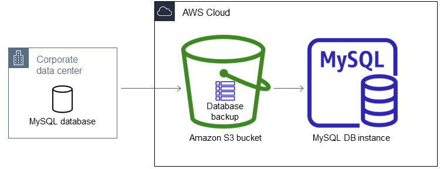

#### 建置 GCP 測試機
>
> 因為測試過程會需要新增 fw 相關設定，故此次測試是使用自己專案自建 VPC，<br>
> 正式啟用時會使用 XPN 架構，但原理跟步驟是相同的

##### 建置 VPC / Subnets

```bash
### VPC
gcloud compute networks create ${VPC_NAME} \
--project=${PROJECT_ID} \
--subnet-mode=custom \
--mtu=1460 \
--bgp-routing-mode=regional \
--bgp-best-path-selection-mode=legacy

### Subnets ( CIDR 自定即可 )
gcloud compute networks subnets create ${SUBNETS_NAME} \
--project=${PROJECT_ID} \
--range=${CIDR} \
--stack-type=IPV4_ONLY \
--network=${VPC_NAME} \
--region=asia-east1
```

##### 建置 FW

```bash
### Allow AWS RDS ( source-ranges 從 AWS VPC -> NAT gateways 查看 )
gcloud compute firewall-rules create ${FW_NAME} \
--project=${PROJECT_ID} \
--direction=INGRESS \
--priority=1000 \
--network=${VPC_NAME} \
--action=ALLOW \
--rules=tcp:3306 \
--source-ranges=18.138.94.177/32,52.77.51.245/32,18.138.128.251/32
```

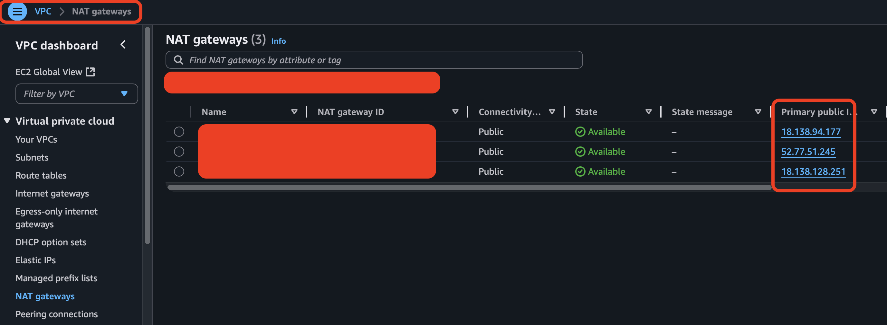

##### 建置 MySQL

這邊是使用內部自研的平台建置，就不贅述了

##### 建置 External Load Balancer

新增 External Load Balancer 跟 Instance Groups，沒有什麼需要特別留意的

#### 使用 PXB 備份至 AWS S3

##### Install AWS CLI

```bash
curl "https://awscli.amazonaws.com/awscli-exe-linux-x86_64.zip" -o "awscliv2.zip"
unzip awscliv2.zip
sudo ./aws/install
```

##### Configuration AWS CLI
>
> 因為 AWS 測試環境的 Account 是採用 SSO 登入，<br>
> 之前 Access Key 的方案已經無法使用囉

```bash
aws configure sso --use-device-code
```

##### PXB 備份至 AWS S3

```bash
### 就單純備份，沒特別要說明的，記得使用 xbstream
xtrabackup --backup --user=${USERNAME} \
--password \
--stream=xbstream > yangtest.xbstream

### 傳到 s3
aws s3 cp yangtest.xbstream s3://aws_s3_bucket_name
```

#### 還原至 AWS RDS
>
> 目前內部使用的 Terraform RDS Modules 已經有支援 Restore From S3 的相關配置，<br>
> 請參考 Github

主要新增

```Terraform
s3_import_bucket_name = "aws_s3_bucket_name"
s3_import_ingestion_role = "arn:aws:iam::xxxxxxxxxxxx:role/rds-restore-from-s3-role"
```

其餘就跟一般使用 Terraform 來部署 RDS 一樣

* `s3_import_bucket_name` : 要還原的 s3 bucket 名稱
* `s3_import_ingestion_role` : 使用哪個 Role 來執行

### Configuring external source replication
>
> [AWS RDS Documentation : Configuring, starting, and stopping binary log ( binlog ) replication # mysql.rds_set_external_master_with_auto_position](https://docs.aws.amazon.com/AmazonRDS/latest/UserGuide/mysql-stored-proc-replicating.html#mysql_rds_set_external_master_with_auto_position)

```MySQL
### 連到 RDS，執行以下 Stored Procedures
CALL mysql.rds_set_external_master_with_auto_position (
  host_name
  , host_port
  , replication_user_name
  , replication_user_password
  , ssl_encryption
  , delay
);

### 本次範例使用的指令
CALL mysql.rds_set_external_master_with_auto_position (
  '35.221.236.11'
  , 3306
  , 'aws_rds_rep'
  , 'YangTest@123'
  , 1
  , 0
);

### 開始同步
CALL mysql.rds_start_replication;

### 然後就成功了
SHOW SLAVE STATUS \G
             Slave_IO_Running: Yes
            Slave_SQL_Running: Yes
```

p.s. 如果 PXB 的來源是 Replica 的話，<br>
可以不用重新設定 `rds_set_external_master_with_auto_position`，<br>
因為相關資料已經存放於 `mysql.slave_master_info` 中，<br>
只需要執行 `mysql.rds_start_replication` 即可

## Troubleshooting

### Q : [內部自研平台] 選不到自建的 Subnets

A : 因為設定檔中有參數來決定監控建置機器所需要使用到的 `網路專案`，<br>
會這樣設計的原因是因為我們網路環境大多是使用 XPN 架構，<br>
所以需要將 `網路專案` 設定為不同的 Project

### Q : [內部自研平台] 還是選不到呀

A : 類似問題，因為設定檔中有設定 `filter` 來過濾 `Subnets`，<br>
原因是因為早期 GCP 專案使用的網路架構是 VPC 不分環境，<br>
也就是 prod、staging 以及 test 等等都在同一個 VPC 底下，<br>
但在自研平台中需要區分環境，<br>
所以才藉由 `filter` 來過濾需要的 `Subnets`

### Q : [IAP] failed to connect to backend

A : 我們目前連線到 GCE 都是藉由 [IAP](https://cloud.google.com/iap/docs) 來實現，<br>
可參考 [GCP IAP Doc](https://cloud.google.com/iap/docs/using-tcp-forwarding#create-firewall-rule) 建置 FW 後就可以連線囉!<br>

```bash
### Allow IAP Access ( CIDR 是固定的 )
gcloud compute firewall-rules create allow-iap-access \
--project=${PROJECT_ID} \
--direction=INGRESS \
--priority=1000 \
--network=${VPC_NAME} \
--action=ALLOW \
--rules=tcp:22 \
--source-ranges=35.235.240.0/20
```

### Q : [startup-script] 沒有執行

A : 因為機器無法對外，需要設定 [Cloud NAT](https://cloud.google.com/nat/docs/overview)<br>

```bash
### Create Cloud Router ( aws-test-router )
gcloud compute routers create aws-test-router \
--project=${PROJECT_ID} \
--region=asia-east1 \
--network=${VPC_NAME}

### Create Cloud NAT gateway ( aws-test-nat )
gcloud compute routers nats create aws-test-nat \
--project=${PROJECT_ID} \
--router=aws-test-router \
--region=asia-east1 \
--nat-all-subnet-ip-ranges \
--auto-allocate-nat-external-ips
```

### Q : [startup-script] 監控安裝失敗

A : 這是一連串的錯誤造成的結果，<br>
Root Cause 是因為呼叫不到內部的 API，<br>
所以沒辦法取得 `my.cnf` 的設定，<br>
造成 `my.cnf` 使用 MySQL 預設的設定，<br>
導致 `startup-script` 執行修改帳密時沒辦法取得密碼而修改失敗，<br>
最終造成的結果就是監控沒辦法登入，出現安裝失敗<br>

解決辦法，暫時將 [上述 Cloud NAT 產生的 IP](#q--startup-script-沒有執行) 新增至 API 的 allow_list

p.s. 成功後記得刪除 allow_list

### Q : [SSO] oauth callback error 127.0.0.1

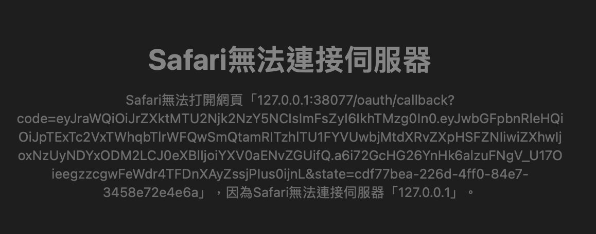

A : 使用 `aws configure sso` 時會跳 OAuth callback 失敗，<br>
請參考 [New SSO Implementation Broken When Used Across Multiple Machines · Issue #9228 · aws/aws-cli](https://github.com/aws/aws-cli/issues/9228)，<br>
加上 `--use-device-code` 即可

### Q : [AWS IAM] 各種權限錯誤

A : 源自於對 AWS IAM 不熟悉導致，<br>
基本上這在 AWS Doc 中都有提到 [Creating an IAM role manually](https://docs.aws.amazon.com/AmazonRDS/latest/UserGuide/MySQL.Procedural.Importing.html#MySQL.Procedural.Importing.Enabling.IAM)

#### Trust Policy

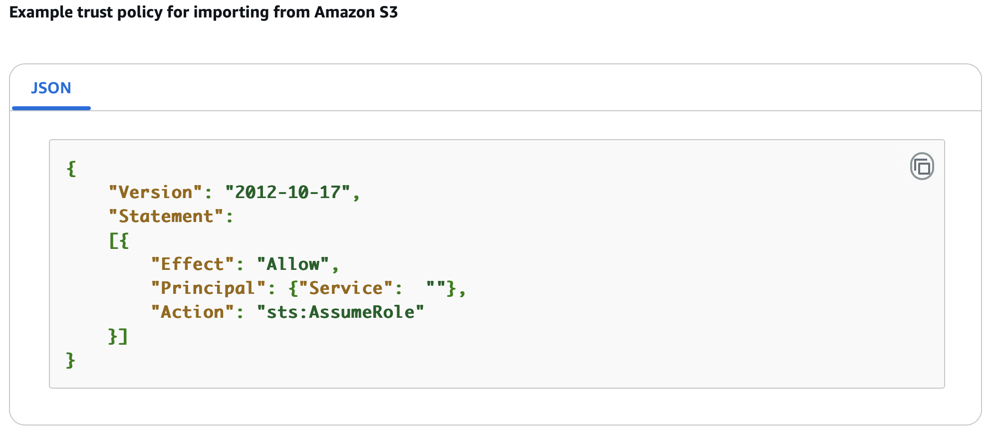

~可能我沒慧根，官方提供的範例真的很範例，~<br>
這邊的 `Service` 要填入 `rds.amazonaws.com`<br>
`{"Service": "rds.amazonaws.com"}`<br>
代表這個 `Role 可以讓 RDS Assume`<br>

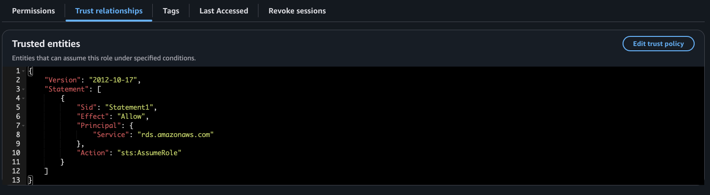

#### Role Permissions

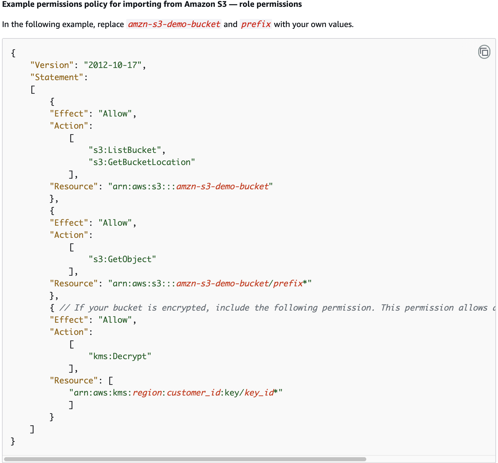

因為這邊我沒有 `Create inline policy` 的權限，<br>
所以我只能先給 AWS managed 的 Policy，<br>
為了符合需求，我這邊是賦予了 `AmazonS3ReadOnlyAccess` 權限

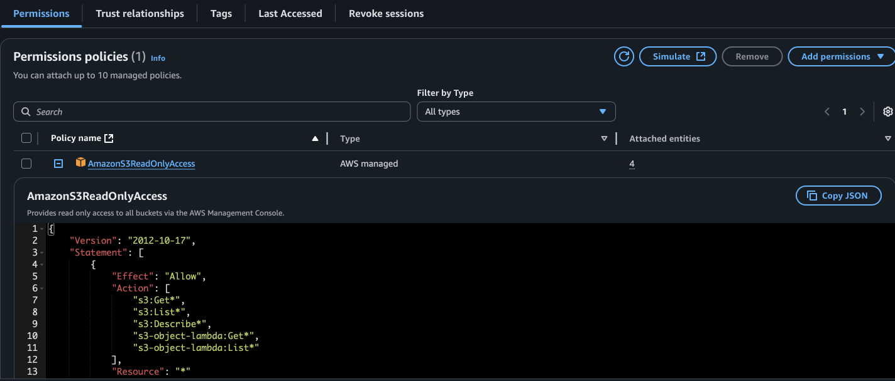

代表這個 `Role 擁有 S3 ReadOnly` 的權限

#### iam:PassRole

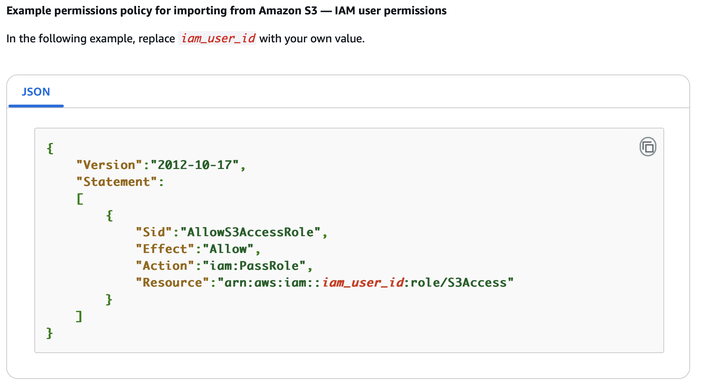

~又是一個不知所云的範例，~<br>
這是要加在 `使用者` 的權限，<br>
以我們目前 AWS Account 的規劃來說，<br>
存在一個 Roles，名稱為 `AWSReservedSSO_DatabaseAdministrator_xxxxxx`，<br>
要將權限加到該 Roles 上，<br>
代表 `擁有 PassRole S3Access 這個 Role 給 Service 的權限`

---

額外說明一下為什麼 AWS 設計 `iam:PassRole` 的原因，主要是安全上的考量

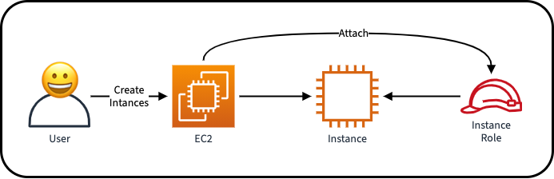

今天有一位 User 建了一台 EC2，並賦予 EC2 `Instance` Role 的權限，<br>
一切都很正常、很美好 :hugging_face::hugging_face::hugging_face:

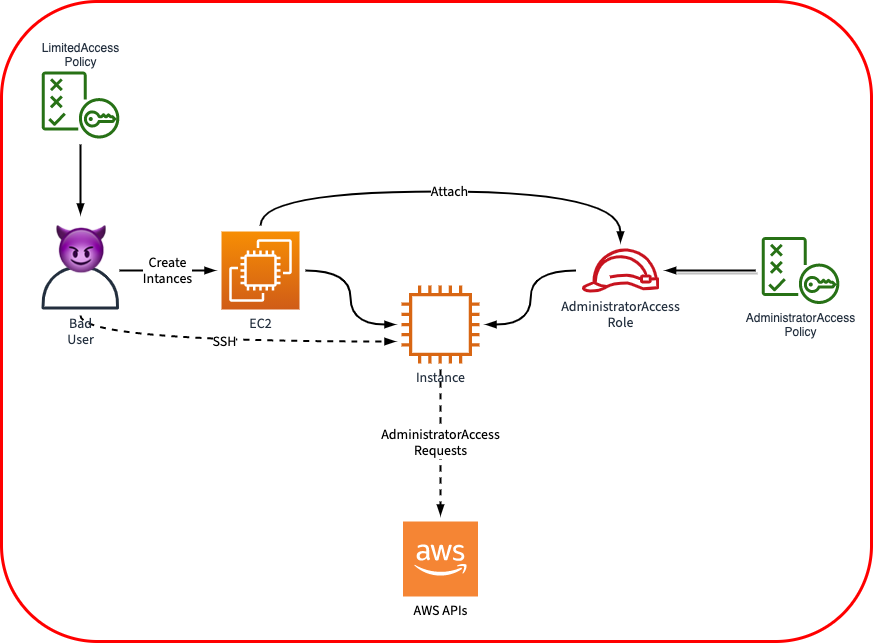

有個 Bad User 出現了，<br>
他明明只有 `LimitedAccessPolicy` 的權限，理論上權限較低，<br>
但因為建了一台 EC2，並賦予 EC2 有較高權限的 `AdministratorAccess` Role，<br>
這時 Bad User 就可以藉由 SSH 到該台 EC2 Instance，<br>
使用較高權限的 Role 去呼叫 AWS 的 APIs，<br>
權限就被繞過去了

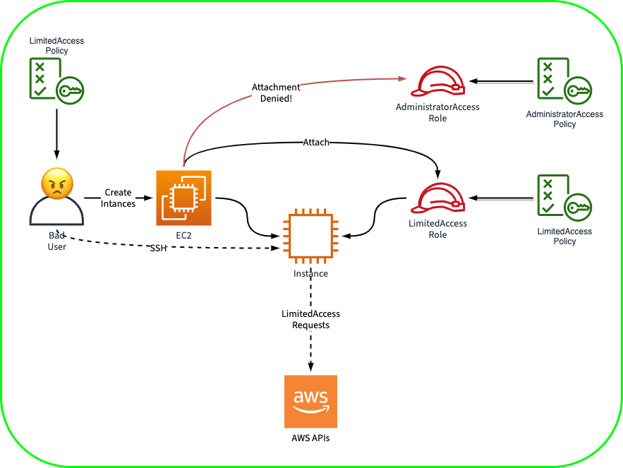

解決方案 `iam:PassRole` 出現了!<br>
主要是用來 `限制 User 可以把哪些 Role 賦予 Service 使用的權限`<br>
以上例子來說，我們可以新增 `Allow iam:PassRole LimitedAccess`

```json
{
  "Effect": "Allow",
  "Action": "iam:PassRole",
  "Resource": "arn:aws:::123456789012:role/LimitedAccess"
}
```

Bad User 便不能賦予 `AdministratorAccess` Role 的權限給 EC2 Service，<br>
只能賦予 `LimitedAccess` Role，一天又平安的過去了，可喜可賀 :hugging_face::hugging_face::hugging_face:

## Summary

基本上這個任務想像起來沒有什麼太大的困難，<br>
實際按照官方 Documentation 操作也只有少少的 1-2 頁，<br>
但就如同本篇文章的現實爆擊，<br>
Troubleshooting 的篇幅大概比實際操作多了一倍以上，<br>
關關難過，但就關關過吧


---

## Reference

* [AWS RDS Documentation : Restoring a backup into an Amazon RDS for MySQL DB instance](https://docs.aws.amazon.com/AmazonRDS/latest/UserGuide/MySQL.Procedural.Importing.html)
* [AWS RDS Documentation : Configuring binary log file position replication with an eternal source instance](https://docs.aws.amazon.com/AmazonRDS/latest/UserGuide/MySQL.Procedural.Importing.External.Repl.html)
* [Rowan Udell : AWS IAM:PassRole explained](https://blog.rowanudell.com/iam-passrole-explained/)
